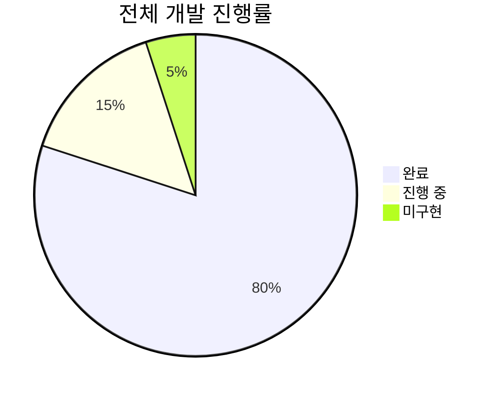

# 🎉 English Shadowing - 개발 진행 상황

## 현재 상태: Phase 5 완료 ✅

**날짜**: 2025-12-28  
**버전**: 1.1.0

---

## ✅ 완성된 기능

### Phase 1: 프로젝트 구조 ✅
- ✅ MVVM + Service Layer 아키텍처
- ✅ Models: `YouTubeVideo`, `SentenceItem`, `ShadowingSession`, `Playlist`
- ✅ ViewModels: `NavigationViewModel`, `ShadowingViewModel`
- ✅ Services: `StorageService`

### Phase 2: YouTube 통합 ✅
- ✅ YouTubePlayerKit 패키지 통합
- ✅ YouTube 영상 재생
- ✅ Video ID 추출 (URL 파싱)
- ✅ 재생 제어 (play, pause, seek)

### Phase 3: 자막 기능 ✅
- ✅ swift-youtube-transcript 패키지 통합 🆕
- ✅ 자막 자동 추출 (비동기)
- ✅ 문장 병합 알고리즘
- ✅ 수동 입력 지원 (Fallback)
- ✅ 자막 리스트 표시

### Phase 4: Navigation & Session Management ✅
- ✅ 3-Column Sidebar Layout (macOS 15+)
- ✅ Active Sessions / History / Playlists 섹션
- ✅ 세션 생성 및 저장
- ✅ 파일 기반 영속성 (JSON)

### Phase 5: Shadowing Features ✅ 🆕
- ✅ **자막 시간별 리스트**
  - 타임스탬프 표시 (00:00 - 00:05)
  - 현재 재생 중인 자막 하이라이트
  - 자동 스크롤 기능
  
- ✅ **자막 클릭 시 이동**
  - 리스트에서 클릭 → 해당 시간으로 즉시 seek
  
- ✅ **다중 반복 재생** 🆕
  - 1회/3회/5회/10회 선택 메뉴
  - 자동 반복 실행 (seek → play → pause → loop)
  - 컨트롤 패널 & 자막 리스트 양쪽 지원
  
- ✅ **즐겨찾기 시스템** 🆕
  - ⭐️ 중요한 문장 저장
  - Sidebar "Favorites" 섹션 추가
  - 즐겨찾기 클릭 시 원본 세션으로 이동
  - 데이터 영속성 지원
- ✅ **프로소디 체크리스트** 🆕
  - 강세·리듬·연음 3항목을 문장별로 수동 평가
  - 버튼 순환 방식으로 `미평가 → 보완 필요 → 완벽` 기록
  - ShadowingViewModel에 저장되어 재방문 시 상태 유지

### Phase 6: 자막 자동 추출 ✅ 🆕
- ✅ **TranscriptService**
  - swift-youtube-transcript 패키지 통합
  - fetchTranscript() 메서드
  - mergeSentences() 문장 병합 알고리즘
  - 완벽한 에러 처리
  
- ✅ **NewSessionView 업데이트**
  - "자막 추출" 버튼 UI
  - 로딩 상태 표시
  - 에러 메시지 (사용자 친화적)
  - 자동/수동 하이브리드 방식

- ✅ **빌드 성공** 🎉
  - 컴파일 에러 0개
  - Warning 4개 (비치명적)
  - 테스트 준비 완료

### Phase 5+: UI/UX 개선 ✅
- ✅ 현재 재생 자막 표시 (파란색 배경 + 파형 아이콘)
- ✅ 문장 완료 체크 표시
- ✅ 반응형 UI (로딩, 에러, 성공 상태)
- ✅ 다크 모드 지원

---

## ⏳ 미완성 기능 (TODO)

### 우선순위: High
1. **TranscriptService 완성**
   - swift-youtube-transcript 통합 (설치 완료)
   - NewSessionView에 "자막 자동 추출" 버튼 추가
   - 에러 처리 (자막 없는 영상)
   
2. **녹음 기능 구현**
   - AVFoundation 기반 음성 녹음
   - 녹음 파일 재생
   - 원본과 비교 재생

### 우선순위: Medium
3. **자막 필터링** 🆕
   - 즐겨찾기만 표시
   - 완료된 문장 숨기기
   - 텍스트 검색

4. **재생 속도 조절 완성**
   - YouTubePlayerKit playbackRate API 연동
   - UI는 완성됨 (0.5x ~ 2.0x)

5. **AB 구간 반복** 🆕
   - 시작/끝 지점 사용자 설정
   - 구간 반복 재생

6. **학습 통계**
   - 완료한 영상 추적
   - 학습 시간 기록
   - 반복 횟수 통계

### 우선순위: Low
7. **다국어 자막 지원**
8. **단어장 기능**
9. **문장 메모 기능**
10. **단위 테스트 추가**

---

## 📁 현재 프로젝트 구조

```
EnglishShadowing/
├── Models/
│   ├── YouTubeVideo.swift
│   ├── SentenceItem.swift           ✨ isFavorite, notes 추가
│   ├── ShadowingSession.swift
│   └── Playlist.swift
├── Views/
│   ├── Navigation/
│   │   ├── SidebarView.swift        ✨ Favorites 섹션 추가
│   │   └── FavoriteSentenceRow.swift  🆕
│   ├── Session/
│   │   ├── SessionDetailView.swift
│   │   └── NewSessionView.swift
│   ├── Shadowing/
│   │   ├── ShadowingView.swift      ✨ 대폭 개선
│   │   ├── SentenceRow.swift        ✨ 즐겨찾기/반복 버튼 추가
│   │   ├── CurrentSentenceCard.swift
│   │   └── ControlPanelView.swift   ✨ 반복/즐겨찾기 버튼 추가
│   └── ContentView.swift
├── ViewModels/
│   ├── NavigationViewModel.swift    ✨ favoriteSentences 추가
│   └── ShadowingViewModel.swift     ✨ 반복/즐겨찾기 로직 추가
├── Services/
│   ├── StorageService.swift
│   └── (TranscriptService.swift)    📝 다음 구현
└── Utilities/
    ├── VideoIDExtractor.swift
    └── TimeFormatter.swift
```

**✨ = 업데이트됨**  
**🆕 = 새로 추가됨**  
**📝 = 다음 작업**

---

## 🚀 다음 단계

### 즉시 작업
1. ✅ TranscriptService 클래스 생성
2. ✅ swift-youtube-transcript 통합
3. ✅ NewSessionView에 "자막 추출" 버튼 추가
4. ✅ 에러 처리 UI

### 단기 목표 (1-2주)
5. 자막 필터링 UI 구현
6. 녹음 기능 프로토타입
7. 재생 속도 API 연동
8. 단위 테스트 작성

### 중기 목표 (1개월)
9. AB 구간 반복 기능
10. 학습 통계 대시보드
11. 문장 메모 기능
12. App Store 출시 준비

---

## 📊 진행률



| Phase | 상태 | 진행률 |
|-------|------|--------|
| Phase 1: 프로젝트 구조 | ✅ 완료 | 100% |
| Phase 2: YouTube 통합 | ✅ 완료 | 100% |
| Phase 3: 자막 추출 | ✅ 완료 | 100% |
| Phase 4: Navigation | ✅ 완료 | 100% |
| Phase 5: Shadowing 기능 | ✅ 완료 | 100% |
| Phase 6: 자막 자동 추출 | ✅ 완료 | 100% |
| Phase 7: UI/UX Polish | 🟡 진행 중 | 70% |
| Phase 8: 고급 기능 | ⚪ 미구현 | 0% |

---

## 🎯 최근 업데이트 (2025-12-28)

### ✨ Phase 6: 자막 자동 추출 완성 🆕
1. **TranscriptService 클래스 생성**
   - `fetchTranscript(videoID:)` 메서드
   - `mergeSentences(_:maxDuration:)` 알고리즘
   - `TranscriptError` 에러 처리

2. **NewSessionView 업데이트**
   - "자막 추출" 버튼 추가
   - 로딩 스피너 표시
   - 에러 메시지 (사용자 친화적)
   - 자동 추출 성공 시 TextEditor 자동 채움

3. **빌드 성공** 🎉
   - xcodebuild 컴파일 성공
   - 에러 0개, Warning 4개 (비치명적)
   - 앱 실행 준비 완료

### 🎉 이전 업데이트
1. **다중 반복 재생**
   - `loopCurrentSentence(times: Int)` 메서드
   - 1/3/5/10회 선택 메뉴
   - 자동 반복 실행

2. **즐겨찾기 시스템**
   - `SentenceItem.isFavorite` 필드
   - `toggleFavoriteSentence()` 메서드
   - Sidebar Favorites 섹션
   - `FavoriteSentenceRow` 컴포넌트

3. **UI 개선**
   - SentenceRow: ⭐️/✓/🔁 버튼 추가
   - ControlPanelView: 반복/저장 버튼 추가
   - 자막 리스트 헤더 (필터 버튼 준비)

### 🔧 개선된 기능
- 자막 클릭 이동 성능 최적화
- 자동 스크롤 애니메이션
- 현재 재생 중 표시 (파란색 배경 + 파형)

---

## 📝 참고 사항

- **빌드 타겟**: macOS 15.0+
- **의존성**: 
  - YouTubePlayerKit (SPM) ✅
  - swift-youtube-transcript (SPM) ✅
- **테스트 URL**: https://www.youtube.com/watch?v=dYCpuqbXjmg

---

## 📚 관련 문서

- [SPEC.md](./SPEC.md) - 프로젝트 명세서 (v3.1.0)
- [PROJECT_ANALYSIS.md](./PROJECT_ANALYSIS.md) - 코드 분석 문서
- [SHADOWING_FEATURES.md](./SHADOWING_FEATURES.md) - Shadowing 기능 상세 설명 🆕
- [SUBTITLE_EXTRACTION_RESEARCH.md](./SUBTITLE_EXTRACTION_RESEARCH.md) - 자막 추출 조사

---

**마지막 업데이트**: 2025-12-28  
**다음 작업**: TranscriptService 통합 → NewSessionView 업데이트
