# 🎯 English Shadowing - 프로젝트 분석 문서

**작성일**: 2025-12-28  
**버전**: 1.0.0  
**플랫폼**: macOS 15.0+ (Sequoia)

---

## 목차

1. [프로젝트 개요](#1-프로젝트-개요)
2. [아키텍처 분석](#2-아키텍처-분석)
3. [코드 흐름 상세 분석](#3-코드-흐름-상세-분석)
4. [주요 컴포넌트 분석](#4-주요-컴포넌트-분석)
5. [데이터 흐름](#5-데이터-흐름)
6. [기술 스택](#6-기술-스택)

---

## 1. 프로젝트 개요

### 1.1 프로젝트 목적
**English Shadowing**은 YouTube 영상을 활용한 macOS 전용 영어 학습 애플리케이션입니다. 사용자가 YouTube 영상의 특정 문장을 반복 재생하며 쉐도잉(Shadowing) 학습을 할 수 있도록 돕습니다.

### 1.2 핵심 기능
- ✅ YouTube 영상 스트리밍 재생
- ✅ 문장 단위 구간 반복 재생
- ✅ 3-Column Sidebar Navigation (Library, Detail, Content)
- ✅ 학습 세션 관리 (Active, History, Playlists)
- ✅ 자동 타이밍 설정
- ✅ 로컬 데이터 저장 (JSON)

### 1.3 프로젝트 상태

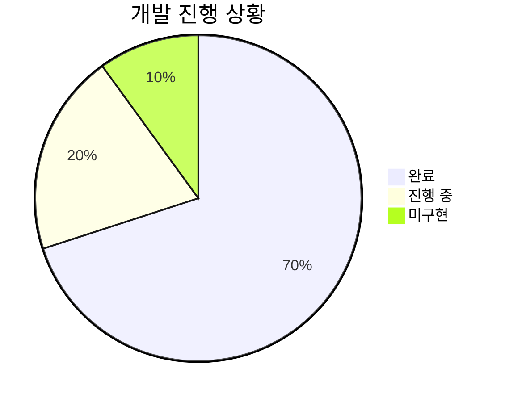
```mermaid
pie title 개발 진행 상황
    "완료" : 70
    "진행 중" : 20
    "미구현" : 10
```

**완료된 기능**:
- ✅ 프로젝트 구조 및 MVVM 아키텍처
- ✅ YouTube 영상 재생 (YouTubePlayerKit)
- ✅ 문장 단위 자동 일시정지
- ✅ Sidebar Navigation UI
- ✅ 세션 관리 (생성, 로드, 저장)
- ✅ 타이밍 자동 계산

**진행 중**:
- 🟡 녹음 기능
- 🟡 재생 속도 조절 (UI만 완성)
- 🟡 학습 통계

**미구현**:
- ⚪ iCloud 동기화
- ⚪ AI 발음 분석

---

## 2. 아키텍처 분석

### 2.1 전체 시스템 아키텍처

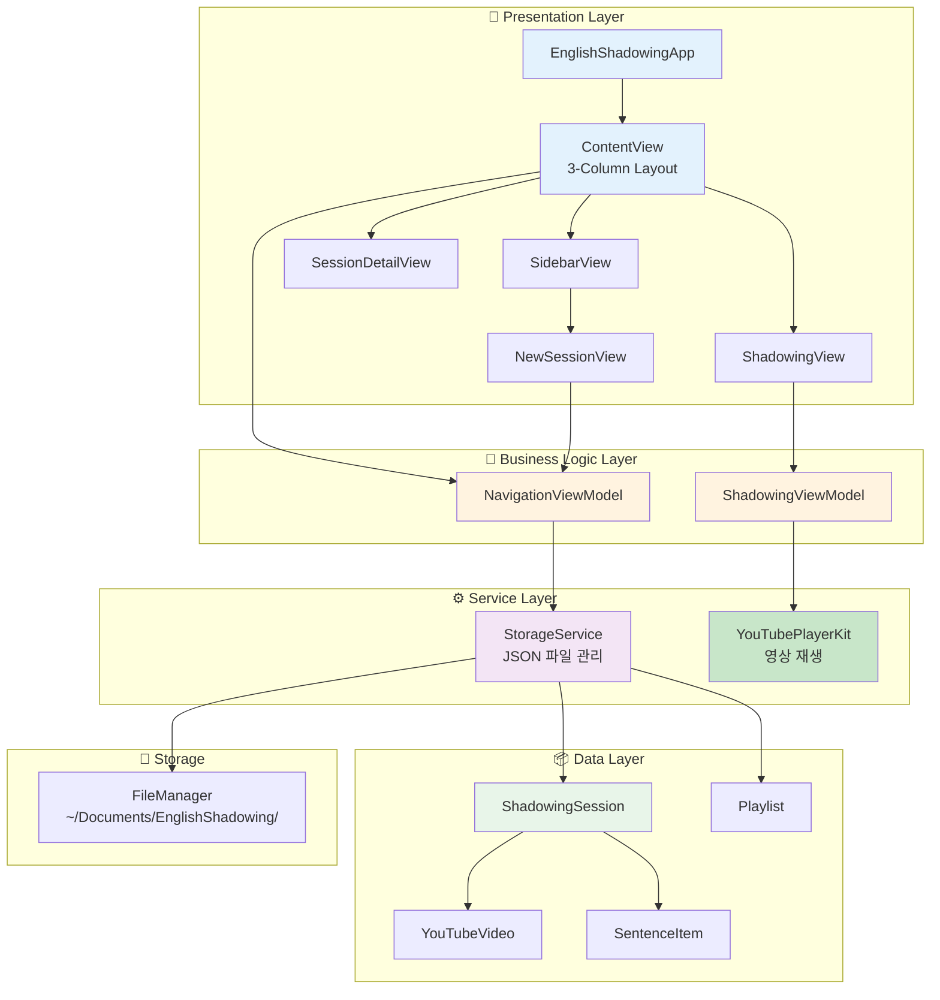
```mermaid
graph TB
    subgraph "🎨 Presentation Layer"
        A[EnglishShadowingApp]
        B[ContentView<br/>3-Column Layout]
        C[SidebarView]
        D[SessionDetailView]
        E[ShadowingView]
        F[NewSessionView]
    end
    
    subgraph "🧠 Business Logic Layer"
        G[NavigationViewModel]
        H[ShadowingViewModel]
    end
    
    subgraph "⚙️ Service Layer"
        I[StorageService<br/>JSON 파일 관리]
        J[YouTubePlayerKit<br/>영상 재생]
    end
    
    subgraph "📦 Data Layer"
        K[ShadowingSession]
        L[YouTubeVideo]
        M[SentenceItem]
        N[Playlist]
    end
    
    subgraph "💾 Storage"
        O[FileManager<br/>~/Documents/EnglishShadowing/]
    end
    
    A --> B
    B --> C
    B --> D
    B --> E
    C --> F
    
    B --> G
    E --> H
    F --> G
    
    G --> I
    H --> J
    
    I --> K
    I --> N
    K --> L
    K --> M
    
    I --> O
    
    style A fill:#E3F2FD
    style B fill:#E3F2FD
    style G fill:#FFF3E0
    style H fill:#FFF3E0
    style I fill:#F3E5F5
    style J fill:#C8E6C9
    style K fill:#E8F5E9
```

### 2.2 MVVM 패턴 적용

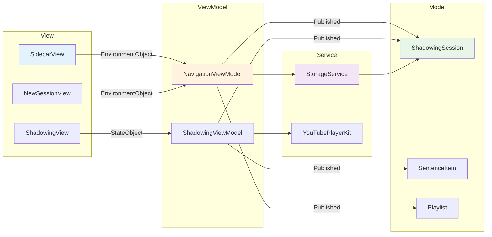
```mermaid
graph LR
    subgraph "View"
        V1[SidebarView]
        V2[ShadowingView]
        V3[NewSessionView]
    end
    
    subgraph "ViewModel"
        VM1[NavigationViewModel]
        VM2[ShadowingViewModel]
    end
    
    subgraph "Model"
        M1[ShadowingSession]
        M2[SentenceItem]
        M3[Playlist]
    end
    
    subgraph "Service"
        S1[StorageService]
        S2[YouTubePlayerKit]
    end
    
    V1 -->|EnvironmentObject| VM1
    V2 -->|StateObject| VM2
    V3 -->|EnvironmentObject| VM1
    
    VM1 -->|Published| M1
    VM1 -->|Published| M3
    VM2 -->|Published| M1
    VM2 -->|Published| M2
    
    VM1 --> S1
    VM2 --> S2
    
    S1 --> M1
    
    style V1 fill:#E3F2FD
    style VM1 fill:#FFF3E0
    style M1 fill:#E8F5E9
    style S1 fill:#F3E5F5
```

---

## 3. 코드 흐름 상세 분석

### 3.1 앱 시작 흐름

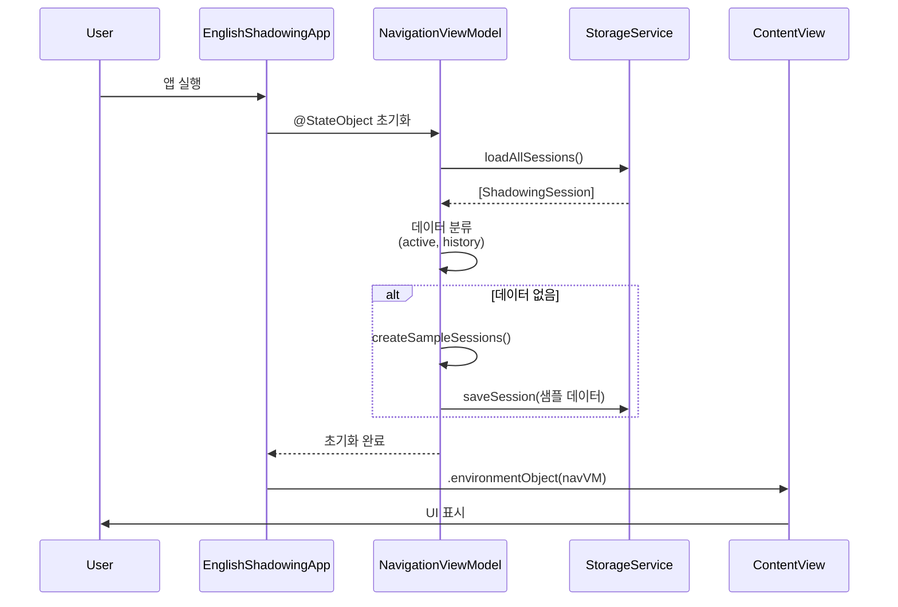
```mermaid
sequenceDiagram
    participant User
    participant App as EnglishShadowingApp
    participant NavVM as NavigationViewModel
    participant Storage as StorageService
    participant ContentView
    
    User->>App: 앱 실행
    App->>NavVM: @StateObject 초기화
    NavVM->>Storage: loadAllSessions()
    Storage-->>NavVM: [ShadowingSession]
    NavVM->>NavVM: 데이터 분류<br/>(active, history)
    
    alt 데이터 없음
        NavVM->>NavVM: createSampleSessions()
        NavVM->>Storage: saveSession(샘플 데이터)
    end
    
    NavVM-->>App: 초기화 완료
    App->>ContentView: .environmentObject(navVM)
    ContentView->>User: UI 표시
```

**코드 위치**: `EnglishShadowingApp.swift`
```swift
@main
struct EnglishShadowingApp: App {
    @StateObject private var navigationVM = NavigationViewModel()
    
    var body: some Scene {
        WindowGroup {
            ContentView()
                .environmentObject(navigationVM)  // ViewModel 주입
                .frame(minWidth: 1200, minHeight: 800)
        }
    }
}
```

**설명**:
1. 앱이 시작되면 `NavigationViewModel`이 `@StateObject`로 생성됩니다.
2. ViewModel은 초기화 시 `loadAllData()`를 호출하여 저장된 세션을 불러옵니다.
3. 데이터가 없으면 샘플 세션을 자동으로 생성합니다.
4. `ContentView`에 `.environmentObject()`로 주입되어 하위 뷰에서 접근 가능합니다.

---

### 3.2 새 세션 생성 흐름

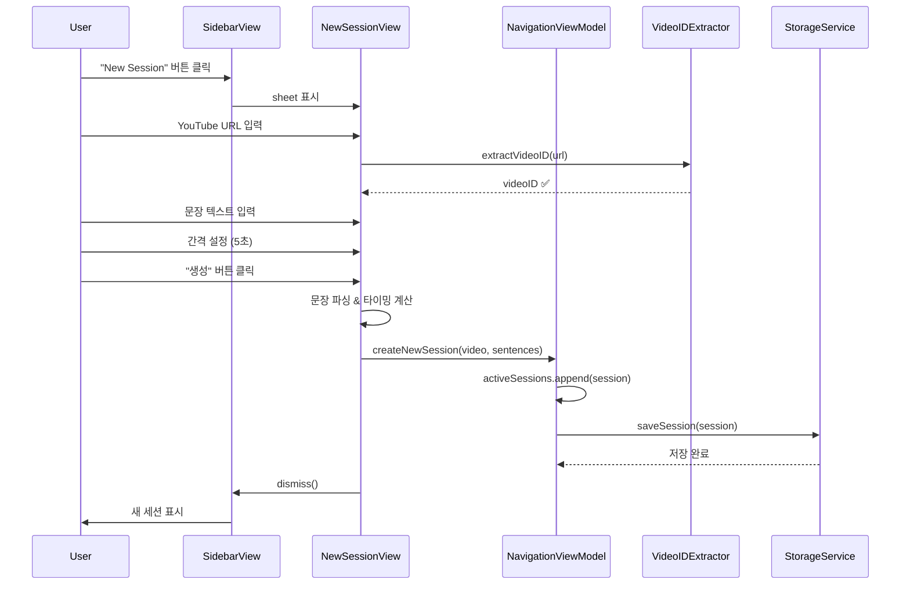
```mermaid
sequenceDiagram
    participant User
    participant Sidebar as SidebarView
    participant NewSession as NewSessionView
    participant NavVM as NavigationViewModel
    participant Extractor as VideoIDExtractor
    participant Storage as StorageService
    
    User->>Sidebar: "New Session" 버튼 클릭
    Sidebar->>NewSession: sheet 표시
    User->>NewSession: YouTube URL 입력
    NewSession->>Extractor: extractVideoID(url)
    Extractor-->>NewSession: videoID ✅
    
    User->>NewSession: 문장 텍스트 입력
    User->>NewSession: 간격 설정 (5초)
    User->>NewSession: "생성" 버튼 클릭
    
    NewSession->>NewSession: 문장 파싱 & 타이밍 계산
    NewSession->>NavVM: createNewSession(video, sentences)
    NavVM->>NavVM: activeSessions.append(session)
    NavVM->>Storage: saveSession(session)
    Storage-->>NavVM: 저장 완료
    
    NewSession->>Sidebar: dismiss()
    Sidebar->>User: 새 세션 표시
```

**코드 위치**: `NewSessionView.swift` - `createSession()`

```swift
private func createSession() {
    // 1. Video ID 추출
    guard let videoID = VideoIDExtractor.extractVideoID(from: youtubeURL) else {
        errorMessage = "유효하지 않은 YouTube URL입니다"
        showError = true
        return
    }
    
    // 2. 문장 파싱 (줄 단위)
    let sentences = sentencesText
        .components(separatedBy: .newlines)
        .filter { !$0.trimmingCharacters(in: .whitespaces).isEmpty }
    
    // 3. Video 객체 생성
    let video = YouTubeVideo(id: videoID, title: videoTitle)
    
    // 4. 타이밍 자동 계산
    var currentTime: TimeInterval = 0
    let sentenceItems = sentences.map { text -> SentenceItem in
        let estimatedDuration = max(Double(text.count) / 10.0, 3.0)  // 최소 3초
        let startTime = currentTime
        let endTime = currentTime + estimatedDuration
        
        currentTime = endTime + intervalSeconds  // 간격 추가
        
        return SentenceItem(text: text, startTime: startTime, endTime: endTime)
    }
    
    // 5. 세션 생성 및 저장
    navigationVM.createNewSession(video: video, sentences: sentenceItems)
    
    dismiss()
}
```

**설명**:
1. **Video ID 추출**: 정규표현식으로 YouTube URL 파싱
2. **문장 파싱**: 줄바꿈 기준으로 문장 분리
3. **타이밍 자동 계산**: 
   - 문자 수 기반 예상 길이 계산 (1글자 = 0.1초)
   - 최소 3초 보장
   - 문장 간격 추가 (기본 5초)
4. **세션 생성**: `NavigationViewModel`을 통해 저장

---

### 3.3 쉐도잉 재생 흐름

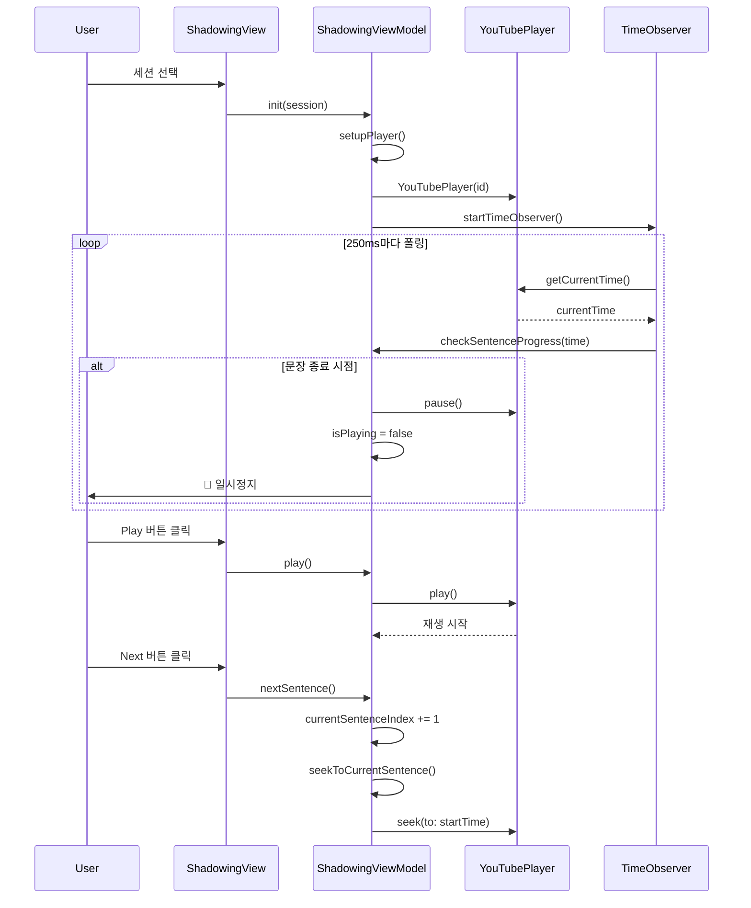
```mermaid
sequenceDiagram
    participant User
    participant ShadowingView
    participant VM as ShadowingViewModel
    participant YPK as YouTubePlayer
    participant TimeObserver
    
    User->>ShadowingView: 세션 선택
    ShadowingView->>VM: init(session)
    VM->>VM: setupPlayer()
    VM->>YPK: YouTubePlayer(id)
    VM->>TimeObserver: startTimeObserver()
    
    loop 250ms마다 폴링
        TimeObserver->>YPK: getCurrentTime()
        YPK-->>TimeObserver: currentTime
        TimeObserver->>VM: checkSentenceProgress(time)
        
        alt 문장 종료 시점
            VM->>YPK: pause()
            VM->>VM: isPlaying = false
            VM->>User: 🔔 일시정지
        end
    end
    
    User->>ShadowingView: Play 버튼 클릭
    ShadowingView->>VM: play()
    VM->>YPK: play()
    YPK-->>VM: 재생 시작
    
    User->>ShadowingView: Next 버튼 클릭
    ShadowingView->>VM: nextSentence()
    VM->>VM: currentSentenceIndex += 1
    VM->>VM: seekToCurrentSentence()
    VM->>YPK: seek(to: startTime)
```

**코드 위치**: `ShadowingViewModel.swift`

#### 3.3.1 YouTubePlayer 초기화

```swift
private func setupPlayer() {
    print("🎬 Setting up YouTube Player with Video ID: \(session.video.id)")
    player = YouTubePlayer(
        source: .video(id: session.video.id)
    )
    
    startTimeObserver()  // 타임 옵저버 시작
}
```

#### 3.3.2 시간 옵저버 (핵심 로직)

```swift
private func startTimeObserver() {
    timeObserverTask = Task { @MainActor in
        guard let player = player else { return }
        
        var lastState: YouTubePlayer.PlaybackState?
        var hasAutoSeeked = false
        
        // 250ms마다 폴링 (60 FPS에 가까운 반응성)
        while !Task.isCancelled {
            do {
                // 1. 현재 시간 가져오기
                let time = try await player.getCurrentTime()
                let seconds = time.converted(to: .seconds).value
                self.currentTime = seconds
                
                // 2. 문장 진행 상황 체크
                self.checkSentenceProgress(time: seconds)
                
                // 3. 재생 상태 변경 감지
                let state = try await player.getPlaybackState()
                
                if lastState != state {
                    print("🎥 Playback State Changed: \(state)")
                    lastState = state
                    
                    switch state {
                    case .unstarted:
                        self.isPlaying = false
                        // 최초 한 번만 자동 seek
                        if !hasAutoSeeked {
                            hasAutoSeeked = true
                            try? await Task.sleep(for: .seconds(1))
                            self.seekToCurrentSentence()
                        }
                    case .playing:
                        self.isPlaying = true
                    case .paused, .ended:
                        self.isPlaying = false
                    default:
                        break
                    }
                }
                
                // 250ms 대기
                try await Task.sleep(for: .milliseconds(250))
            } catch {
                if !Task.isCancelled {
                    print("⚠️ Observer error: \(error)")
                }
            }
        }
    }
}
```

**설명**:
1. **비동기 Task**: SwiftUI `@MainActor`에서 안전하게 상태 업데이트
2. **250ms 폴링**: 부드러운 UI 업데이트를 위한 빠른 주기
3. **상태 변경 감지**: `lastState`와 비교하여 중복 처리 방지
4. **자동 Seek**: 영상 로드 후 첫 문장으로 자동 이동

#### 3.3.3 문장 종료 자동 일시정지

```swift
private func checkSentenceProgress(time: TimeInterval) {
    guard let sentence = currentSentence else { return }
    
    // 0.5초 버퍼로 정확한 감지
    let isNearEnd = time >= (sentence.endTime - 0.5) && time <= (sentence.endTime + 0.5)
    
    if isNearEnd && isPlaying {
        print("⏸ Auto-pausing at \(time)s (sentence ends at \(sentence.endTime)s)")
        Task {
            try? await player?.pause()
            self.isPlaying = false
        }
    }
}
```

**설명**:
- **0.5초 버퍼**: 타이밍 오차를 고려한 범위 체크
- **isPlaying 조건**: 이미 일시정지 상태면 중복 호출 방지
- **비동기 처리**: `Task`로 Player API 호출

---

### 3.4 데이터 저장 흐름

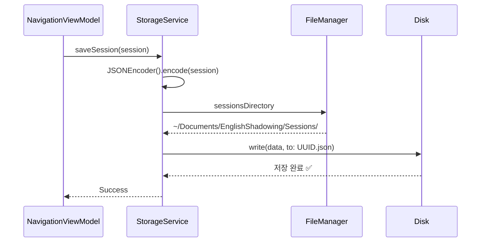
```mermaid
sequenceDiagram
    participant VM as NavigationViewModel
    participant Storage as StorageService
    participant FileManager
    participant Disk
    
    VM->>Storage: saveSession(session)
    Storage->>Storage: JSONEncoder().encode(session)
    Storage->>FileManager: sessionsDirectory
    FileManager-->>Storage: ~/Documents/EnglishShadowing/Sessions/
    Storage->>Disk: write(data, to: UUID.json)
    Disk-->>Storage: 저장 완료 ✅
    Storage-->>VM: Success
```

**코드 위치**: `StorageService.swift`

```swift
class StorageService {
    static let shared = StorageService()
    
    private var sessionsDirectory: URL {
        let documentsURL = fileManager.urls(for: .documentDirectory, in: .userDomainMask)[0]
        let sessionsURL = documentsURL.appendingPathComponent("EnglishShadowing/Sessions")
        
        // 디렉토리 없으면 생성
        if !fileManager.fileExists(atPath: sessionsURL.path) {
            try? fileManager.createDirectory(at: sessionsURL, withIntermediateDirectories: true)
        }
        return sessionsURL
    }
    
    func saveSession(_ session: ShadowingSession) throws {
        let fileURL = sessionsDirectory.appendingPathComponent("\(session.id.uuidString).json")
        let data = try encoder.encode(session)  // Codable 프로토콜 사용
        try data.write(to: fileURL)
    }
    
    func loadAllSessions() throws -> [ShadowingSession] {
        let files = try fileManager.contentsOfDirectory(at: sessionsDirectory, 
                                                        includingPropertiesForKeys: nil)
        
        return try files.compactMap { url in
            guard url.pathExtension == "json" else { return nil }
            let data = try Data(contentsOf: url)
            return try decoder.decode(ShadowingSession.self, from: data)
        }
    }
}
```

**설명**:
1. **Singleton 패턴**: `shared` 인스턴스로 전역 접근
2. **자동 디렉토리 생성**: 최초 실행 시 폴더 생성
3. **UUID 파일명**: 각 세션은 고유 ID로 저장
4. **Codable 활용**: Swift의 자동 직렬화/역직렬화

**저장 경로**:
```
~/Documents/
  └── EnglishShadowing/
       ├── Sessions/
       │    ├── 12345678-1234-5678-1234-567812345678.json
       │    └── 87654321-4321-8765-4321-876543218765.json
       └── Playlists/
            └── abcdefab-abcd-efab-cdef-abcdefabcdef.json
```

---

## 4. 주요 컴포넌트 분석

### 4.1 ContentView (3-Column Layout)

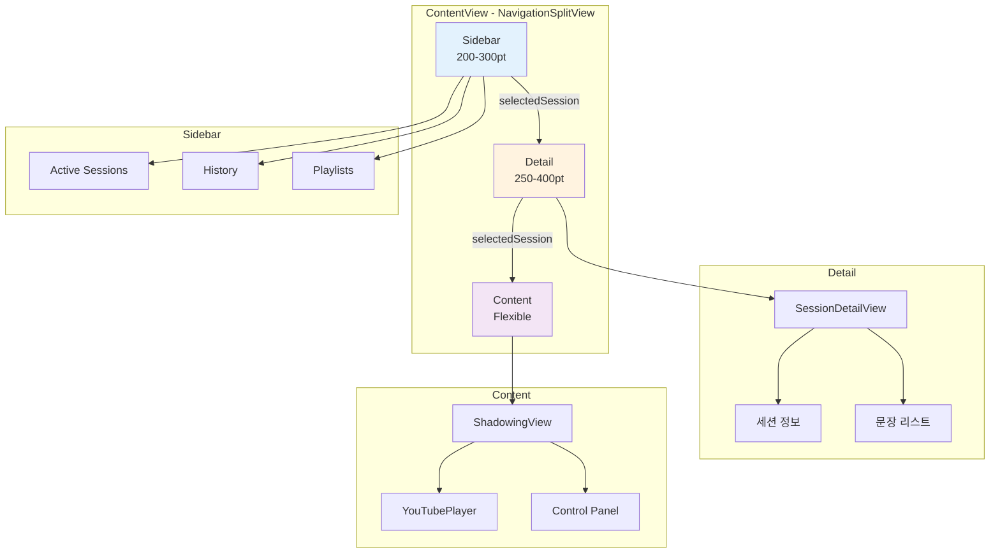
```mermaid
graph TB
    subgraph "ContentView - NavigationSplitView"
        A[Sidebar<br/>200-300pt]
        B[Detail<br/>250-400pt]
        C[Content<br/>Flexible]
    end
    
    A -->|selectedSession| B
    B -->|selectedSession| C
    
    subgraph "Sidebar"
        A1[Active Sessions]
        A2[History]
        A3[Playlists]
    end
    
    subgraph "Detail"
        B1[SessionDetailView]
        B2[세션 정보]
        B3[문장 리스트]
    end
    
    subgraph "Content"
        C1[ShadowingView]
        C2[YouTubePlayer]
        C3[Control Panel]
    end
    
    A --> A1
    A --> A2
    A --> A3
    
    B --> B1
    B1 --> B2
    B1 --> B3
    
    C --> C1
    C1 --> C2
    C1 --> C3
    
    style A fill:#E3F2FD
    style B fill:#FFF3E0
    style C fill:#F3E5F5
```

**코드**:
```swift
struct ContentView: View {
    @EnvironmentObject var navigationVM: NavigationViewModel
    @State private var selectedSession: ShadowingSession?
    
    var body: some View {
        NavigationSplitView {
            // Sidebar (왼쪽)
            SidebarView(selectedSession: $selectedSession)
                .navigationSplitViewColumnWidth(min: 200, ideal: 250, max: 300)
        } content: {
            // Detail View (중간)
            if let session = selectedSession {
                SessionDetailView(session: session)
                    .navigationSplitViewColumnWidth(min: 250, ideal: 300, max: 400)
            }
        } detail: {
            // Content View (오른쪽)
            if let session = selectedSession {
                ShadowingView(session: session)
            }
        }
    }
}
```

**설명**:
- **NavigationSplitView**: macOS의 3-column 레이아웃
- **Binding**: `selectedSession`을 통해 Sidebar → Detail → Content 연결
- **반응형 너비**: `min`, `ideal`, `max`로 유연한 레이아웃

---

### 4.2 ShadowingView (메인 학습 화면)

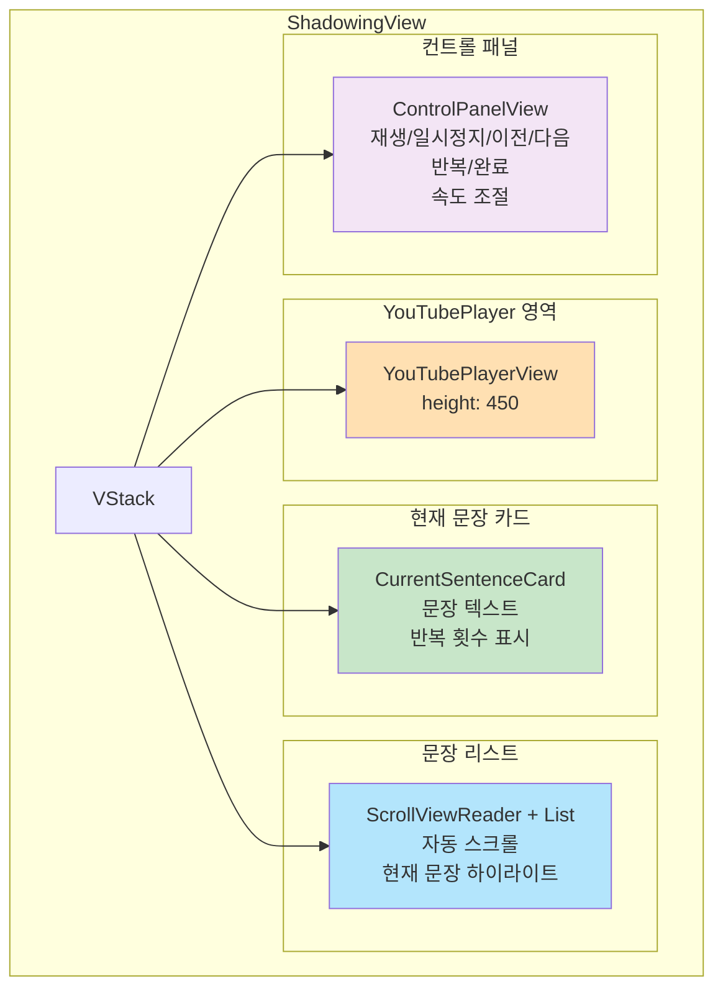
```mermaid
graph TB
    subgraph "ShadowingView"
        A[VStack]
        
        subgraph "YouTubePlayer 영역"
            B[YouTubePlayerView<br/>height: 450]
        end
        
        subgraph "현재 문장 카드"
            C[CurrentSentenceCard<br/>문장 텍스트<br/>반복 횟수 표시]
        end
        
        subgraph "문장 리스트"
            D[ScrollViewReader + List<br/>자동 스크롤<br/>현재 문장 하이라이트]
        end
        
        subgraph "컨트롤 패널"
            E[ControlPanelView<br/>재생/일시정지/이전/다음<br/>반복/완료<br/>속도 조절]
        end
    end
    
    A --> B
    A --> C
    A --> D
    A --> E
    
    style B fill:#FFE0B2
    style C fill:#C8E6C9
    style D fill:#B3E5FC
    style E fill:#F3E5F5
```

**주요 구성 요소**:

#### 4.2.1 YouTubePlayerView
```swift
if let player = viewModel.player {
    YouTubePlayerView(player)
        .frame(height: 450)
        .cornerRadius(12)
        .padding()
}
```
- YouTubePlayerKit의 View 래퍼
- 16:9 비율 유지 (450pt 높이)

#### 4.2.2 CurrentSentenceCard
```swift
CurrentSentenceCard(
    sentence: sentence,
    repeatCount: viewModel.repeatCount,
    totalRepeats: sentence.repeatCount
)
```
- 현재 재생 중인 문장 표시
- 반복 횟수 시각화 (●●○)

#### 4.2.3 자동 스크롤 리스트
```swift
ScrollViewReader { proxy in
    List(...) { ... }
    .onChange(of: viewModel.currentSentenceIndex) { _, newIndex in
        withAnimation {
            proxy.scrollTo(viewModel.session.sentences[newIndex].id, anchor: .center)
        }
    }
}
```
- 현재 문장으로 자동 스크롤
- 부드러운 애니메이션

#### 4.2.4 ControlPanelView
```swift
HStack {
    Button(action: viewModel.previousSentence) { ... }
    Button(action: viewModel.togglePlayPause) { ... }  // 중앙 큰 버튼
    Button(action: viewModel.nextSentence) { ... }
    Button("반복", action: viewModel.repeatCurrentSentence) { ... }
    Button("완료", action: viewModel.markCurrentSentenceCompleted) { ... }
}
```

---

### 4.3 NavigationViewModel (세션 관리)

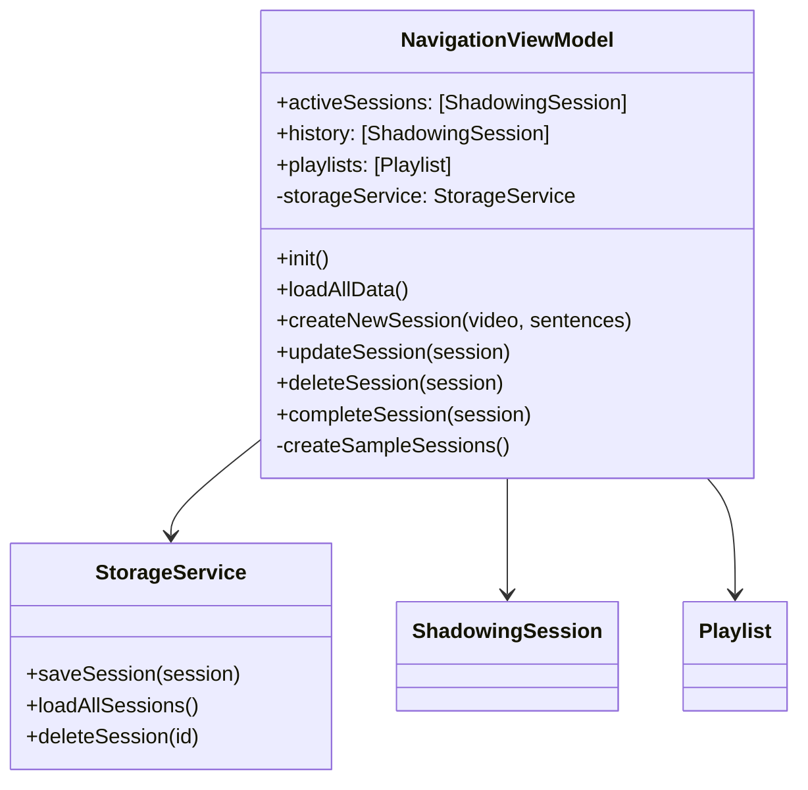
```mermaid
classDiagram
    class NavigationViewModel {
        +activeSessions: [ShadowingSession]
        +history: [ShadowingSession]
        +playlists: [Playlist]
        -storageService: StorageService
        
        +init()
        +loadAllData()
        +createNewSession(video, sentences)
        +updateSession(session)
        +deleteSession(session)
        +completeSession(session)
        -createSampleSessions()
    }
    
    class StorageService {
        +saveSession(session)
        +loadAllSessions()
        +deleteSession(id)
    }
    
    NavigationViewModel --> StorageService
    NavigationViewModel --> ShadowingSession
    NavigationViewModel --> Playlist
```

**역할**:
1. **세션 목록 관리**: Active/History 분류
2. **CRUD 작업**: 생성, 읽기, 업데이트, 삭제
3. **상태 전환**: Active → Completed
4. **샘플 데이터 생성**: 최초 실행 시

**코드**:
```swift
@MainActor
class NavigationViewModel: ObservableObject {
    @Published var activeSessions: [ShadowingSession] = []
    @Published var history: [ShadowingSession] = []
    @Published var playlists: [Playlist] = []
    
    func createNewSession(video: YouTubeVideo, sentences: [SentenceItem]) {
        let session = ShadowingSession(video: video, sentences: sentences, status: .active)
        activeSessions.append(session)
        
        Task {
            try? storageService.saveSession(session)
        }
    }
    
    func completeSession(_ session: ShadowingSession) {
        var updatedSession = session
        updatedSession.status = .completed
        updatedSession.updatedAt = Date()
        
        activeSessions.removeAll { $0.id == session.id }
        history.insert(updatedSession, at: 0)  // 최신 순 정렬
        
        Task {
            try? storageService.saveSession(updatedSession)
        }
    }
}
```

---

### 4.4 ShadowingViewModel (재생 제어)

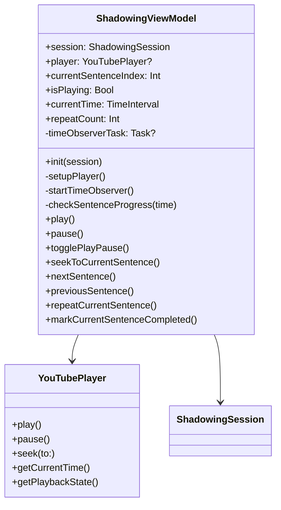
```mermaid
classDiagram
    class ShadowingViewModel {
        +session: ShadowingSession
        +player: YouTubePlayer?
        +currentSentenceIndex: Int
        +isPlaying: Bool
        +currentTime: TimeInterval
        +repeatCount: Int
        -timeObserverTask: Task?
        
        +init(session)
        -setupPlayer()
        -startTimeObserver()
        -checkSentenceProgress(time)
        +play()
        +pause()
        +togglePlayPause()
        +seekToCurrentSentence()
        +nextSentence()
        +previousSentence()
        +repeatCurrentSentence()
        +markCurrentSentenceCompleted()
    }
    
    class YouTubePlayer {
        +play()
        +pause()
        +seek(to:)
        +getCurrentTime()
        +getPlaybackState()
    }
    
    ShadowingViewModel --> YouTubePlayer
    ShadowingViewModel --> ShadowingSession
```

**주요 메서드**:

#### play() / pause()
```swift
func play() {
    Task {
        try await player?.play()
        self.isPlaying = true
    }
}

func pause() {
    Task {
        try await player?.pause()
        self.isPlaying = false
    }
}
```

#### seekToCurrentSentence()
```swift
func seekToCurrentSentence() {
    guard let sentence = currentSentence else { return }
    Task {
        try await player?.seek(
            to: .init(value: sentence.startTime, unit: .seconds),
            allowSeekAhead: true
        )
    }
}
```

#### nextSentence() / previousSentence()
```swift
func nextSentence() {
    if currentSentenceIndex < session.sentences.count - 1 {
        currentSentenceIndex += 1
        repeatCount = 0  // 반복 횟수 초기화
        seekToCurrentSentence()
    }
}
```

---

## 5. 데이터 흐름

### 5.1 사용자 인터랙션 → UI 업데이트

```mermaid
flowchart LR
    A[User Action] --> B[View]
    B --> C[ViewModel<br/>@Published 변경]
    C --> D[SwiftUI 자동 렌더링]
    D --> E[UI 업데이트]
    
    style A fill:#FFE0B2
    style C fill:#FFF3E0
    style E fill:#C8E6C9
```

**예시: Play 버튼 클릭**

```swift
// 1. User Action
Button(action: viewModel.togglePlayPause) { ... }

// 2. ViewModel
func togglePlayPause() {
    if isPlaying {
        pause()  // @Published isPlaying = false
    } else {
        play()   // @Published isPlaying = true
    }
}

// 3. View 자동 업데이트
Image(systemName: viewModel.isPlaying ? "pause.circle.fill" : "play.circle.fill")
```

---

### 5.2 데이터 영속성 흐름

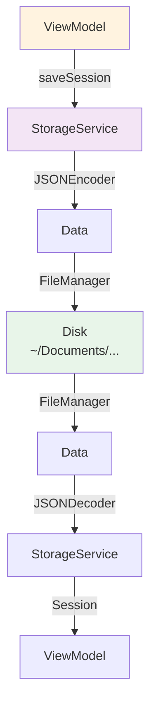
```mermaid
flowchart TB
    A[ViewModel] -->|saveSession| B[StorageService]
    B -->|JSONEncoder| C[Data]
    C -->|FileManager| D[Disk<br/>~/Documents/...]
    
    D -->|FileManager| E[Data]
    E -->|JSONDecoder| F[StorageService]
    F -->|Session| G[ViewModel]
    
    style A fill:#FFF3E0
    style B fill:#F3E5F5
    style D fill:#E8F5E9
```

**저장**:
```
NavigationViewModel 
  → createNewSession() 
  → StorageService.saveSession()
  → JSONEncoder.encode()
  → FileManager.write()
  → Disk
```

**로드**:
```
Disk 
  → FileManager.read()
  → JSONDecoder.decode()
  → StorageService.loadAllSessions()
  → NavigationViewModel
```

---

### 5.3 State 관리 전략

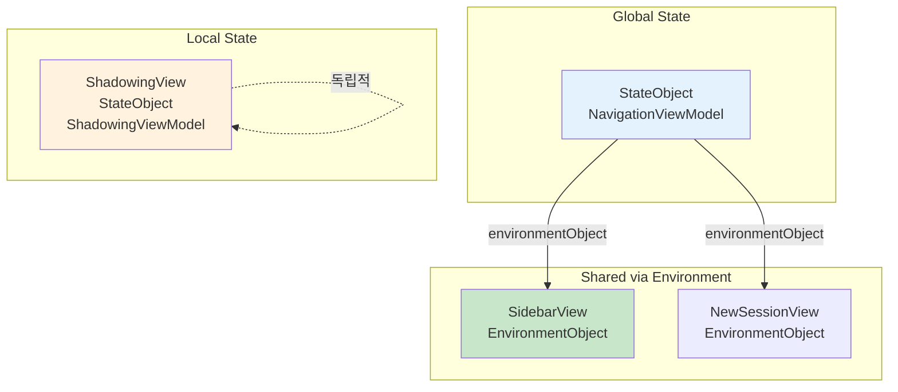
```mermaid
graph TB
    subgraph "Global State"
        A[StateObject<br/>NavigationViewModel]
    end
    
    subgraph "Shared via Environment"
        B[SidebarView<br/>EnvironmentObject]
        C[NewSessionView<br/>EnvironmentObject]
    end
    
    subgraph "Local State"
        D[ShadowingView<br/>StateObject<br/>ShadowingViewModel]
    end
    
    A -->|environmentObject| B
    A -->|environmentObject| C
    D -.->|독립적| D
    
    style A fill:#E3F2FD
    style B fill:#C8E6C9
    style D fill:#FFF3E0
```

**전략**:
1. **NavigationViewModel**: 앱 전역 상태 (세션 목록)
2. **ShadowingViewModel**: 뷰 로컬 상태 (재생 제어)
3. **@EnvironmentObject**: 깊은 계층 구조에서 ViewModel 전달
4. **@StateObject**: 뷰의 생명주기와 함께 관리

---

## 6. 기술 스택

### 6.1 프레임워크 & 라이브러리

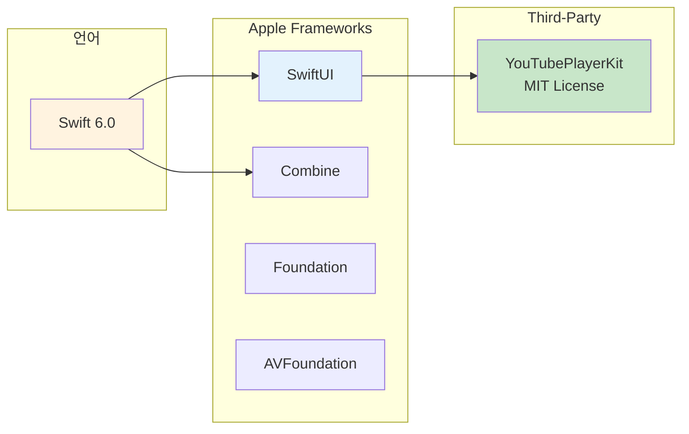
```mermaid
graph LR
    subgraph "Apple Frameworks"
        A[SwiftUI]
        B[Combine]
        C[Foundation]
        D[AVFoundation]
    end
    
    subgraph "Third-Party"
        E[YouTubePlayerKit<br/>MIT License]
    end
    
    subgraph "언어"
        F[Swift 6.0]
    end
    
    F --> A
    F --> B
    A --> E
    
    style A fill:#E3F2FD
    style E fill:#C8E6C9
    style F fill:#FFF3E0
```

| 기술 | 버전 | 용도 |
|------|------|------|
| Swift | 6.0 | 주 언어 |
| SwiftUI | macOS 15.0+ | UI 프레임워크 |
| Combine | - | 반응형 프로그래밍 |
| YouTubePlayerKit | 1.9.0 | YouTube 재생 |
| AVFoundation | - | 녹음 기능 (미구현) |

### 6.2 아키텍처 패턴

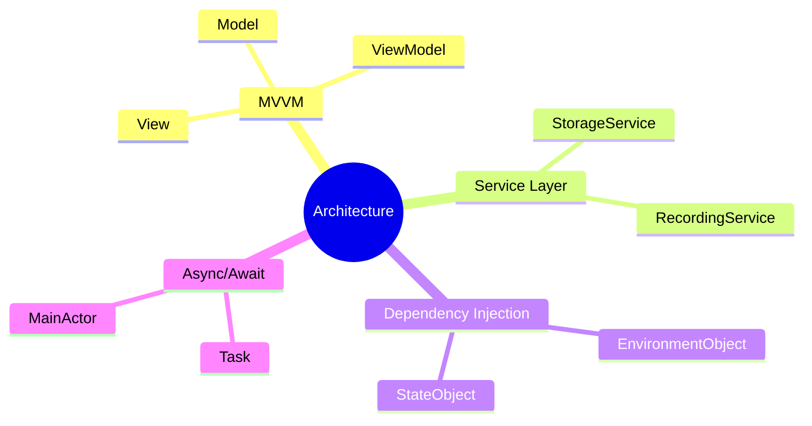
```mermaid
mindmap
  root((Architecture))
    MVVM
      View
      ViewModel
      Model
    Service Layer
      StorageService
      RecordingService
    Dependency Injection
      EnvironmentObject
      StateObject
    Async/Await
      Task
      MainActor
```

**핵심 패턴**:
1. **MVVM**: View - ViewModel - Model 분리
2. **Service Layer**: 비즈니스 로직 캡슐화
3. **Dependency Injection**: `@EnvironmentObject`로 의존성 주입
4. **Async/Await**: 비동기 작업 처리
5. **Observer Pattern**: `@Published`로 상태 변경 알림

### 6.3 코드 구조

```
EnglishShadowing/
├── App/
│   └── EnglishShadowingApp.swift          # 앱 엔트리포인트
│
├── Views/                                  # 📱 Presentation Layer
│   ├── Navigation/
│   │   └── SidebarView.swift              # Sidebar UI
│   ├── Session/
│   │   ├── SessionDetailView.swift        # 세션 상세 정보
│   │   └── NewSessionView.swift           # 새 세션 생성 폼
│   ├── Shadowing/
│   │   └── ShadowingView.swift            # 메인 학습 화면
│   └── ContentView.swift                  # 3-Column Layout
│
├── ViewModels/                            # 🧠 Business Logic
│   ├── NavigationViewModel.swift          # 전역 상태 관리
│   └── ShadowingViewModel.swift           # 재생 제어 로직
│
├── Models/                                # 📦 Data Models
│   ├── ShadowingSession.swift             # 세션 데이터
│   ├── SentenceItem.swift                 # 문장 데이터
│   ├── YouTubeVideo.swift                 # 영상 메타데이터
│   └── Playlist.swift                     # 플레이리스트
│
├── Services/                              # ⚙️ Service Layer
│   └── StorageService.swift               # 파일 I/O
│
├── Utilities/                             # 🛠️ Helpers
│   ├── VideoIDExtractor.swift             # URL 파싱
│   └── TimeFormatter.swift                # 시간 포맷팅
│
└── Resources/
    └── Assets.xcassets                    # 이미지/아이콘
```

---

## 7. 성능 최적화

### 7.1 비동기 작업 최적화

```swift
// ❌ Bad: Main Thread 블로킹
func loadSessions() {
    let sessions = try! storageService.loadAllSessions()  // 동기 I/O
    self.activeSessions = sessions
}

// ✅ Good: 백그라운드 Task
func loadAllData() {
    Task {  // 비동기 실행
        do {
            let sessions = try storageService.loadAllSessions()
            
            // MainActor에서 UI 업데이트
            await MainActor.run {
                self.activeSessions = sessions.filter { $0.status == .active }
                self.history = sessions.filter { $0.status == .completed }
            }
        } catch {
            print("Failed to load data: \(error)")
        }
    }
}
```

### 7.2 타임 옵저버 최적화

```swift
// 250ms 폴링 주기
try await Task.sleep(for: .milliseconds(250))

// 이유:
// - 60 FPS = 16.67ms → 250ms는 충분히 부드러움
// - CPU 사용률 최소화
// - YouTubePlayerKit API 호출 빈도 제한
```

### 7.3 메모리 관리

```swift
deinit {
    timeObserverTask?.cancel()  // Task 취소
}
```

---

## 8. 향후 개선 사항

### 8.1 미구현 기능

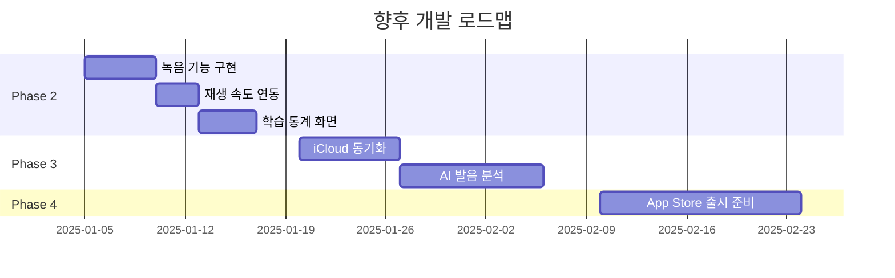
```mermaid
gantt
    title 향후 개발 로드맵
    dateFormat YYYY-MM-DD
    section Phase 2
    녹음 기능 구현           :p1, 2025-01-05, 5d
    재생 속도 연동           :p2, after p1, 3d
    학습 통계 화면           :p3, after p2, 4d
    section Phase 3
    iCloud 동기화            :p4, 2025-01-20, 7d
    AI 발음 분석             :p5, after p4, 10d
    section Phase 4
    App Store 출시 준비      :p6, 2025-02-10, 14d
```

### 8.2 기술 부채

| 항목 | 현재 상태 | 개선 방안 |
|------|----------|----------|
| 재생 속도 조절 | UI만 구현 | YouTubePlayerKit API 연동 필요 |
| 에러 처리 | 단순 로깅 | 사용자 친화적 에러 UI |
| 테스트 코드 | 없음 | Unit Test & UI Test 작성 |
| 문서화 | 주석 부족 | DocC 문서 생성 |

### 8.3 성능 개선 아이디어

1. **Lazy Loading**: 문장 리스트 가상화 (대량 데이터 처리)
2. **Caching**: 세션 메타데이터 메모리 캐싱
3. **Debouncing**: 사용자 입력 최적화
4. **Image Optimization**: YouTube 썸네일 캐싱

---

## 9. 결론

### 9.1 프로젝트 강점

✅ **명확한 아키텍처**: MVVM + Service Layer로 유지보수성 ↑  
✅ **모던 Swift**: async/await, Combine 활용  
✅ **macOS 네이티브 UX**: 3-Column Layout, Sidebar Navigation  
✅ **확장 가능성**: 모듈화된 구조로 기능 추가 용이  

### 9.2 학습 포인트

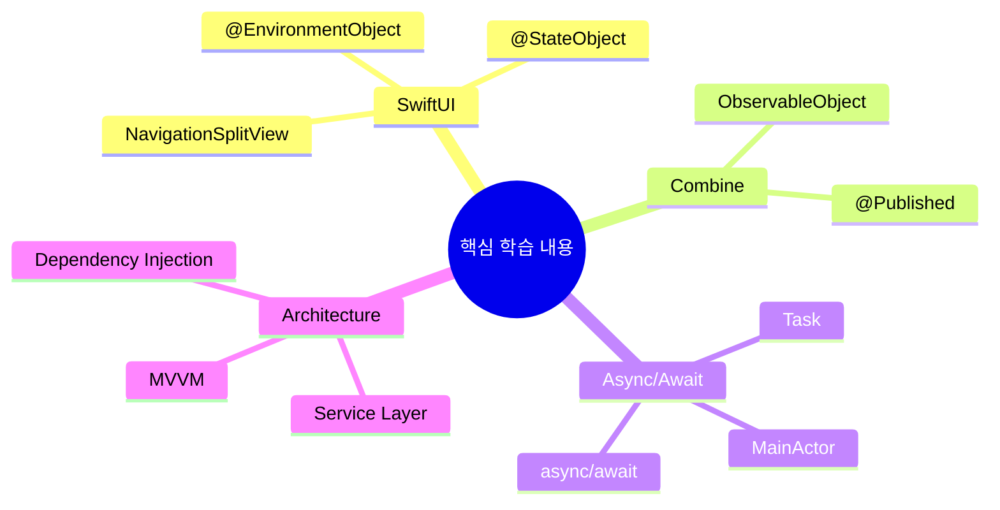
```mermaid
mindmap
  root((핵심 학습 내용))
    SwiftUI
      NavigationSplitView
      @StateObject
      @EnvironmentObject
    Combine
      @Published
      ObservableObject
    Async/Await
      Task
      MainActor
      async/await
    Architecture
      MVVM
      Service Layer
      Dependency Injection
```

### 9.3 코드 흐름 요약

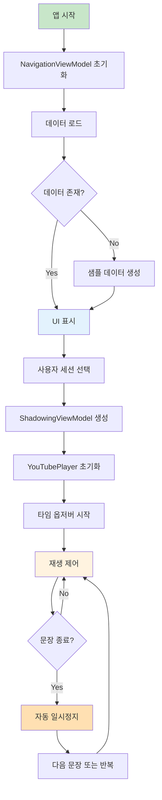
```mermaid
flowchart TB
    A[앱 시작] --> B[NavigationViewModel 초기화]
    B --> C[데이터 로드]
    C --> D{데이터 존재?}
    D -->|No| E[샘플 데이터 생성]
    D -->|Yes| F[UI 표시]
    E --> F
    
    F --> G[사용자 세션 선택]
    G --> H[ShadowingViewModel 생성]
    H --> I[YouTubePlayer 초기화]
    I --> J[타임 옵저버 시작]
    
    J --> K[재생 제어]
    K --> L{문장 종료?}
    L -->|Yes| M[자동 일시정지]
    L -->|No| K
    
    M --> N[다음 문장 또는 반복]
    N --> K
    
    style A fill:#C8E6C9
    style F fill:#E3F2FD
    style K fill:#FFF3E0
    style M fill:#FFE0B2
```

---

**문서 작성**: 2025-12-28  
**버전**: 1.0.0  
**라이센스**: MIT  
**연락처**: [GitHub Issues](https://github.com/your-repo/english-shadowing)

