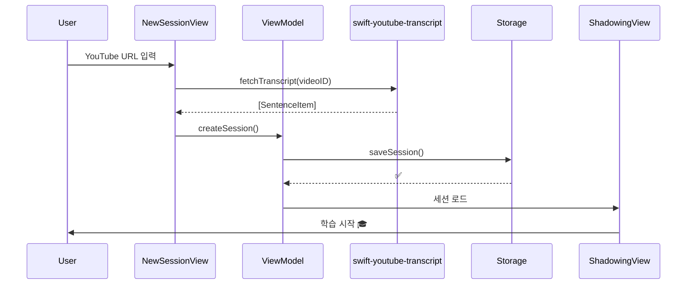
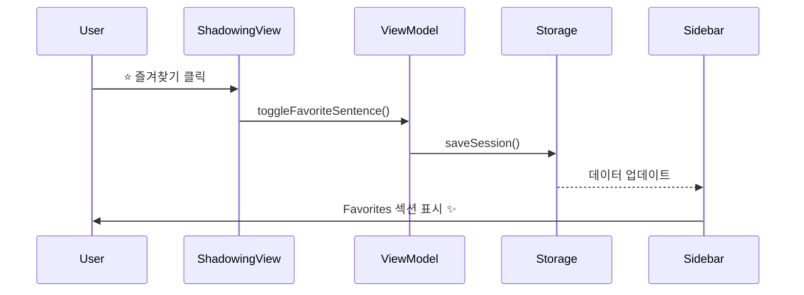

# 🎓 English Shadowing - macOS

> YouTube 영상으로 효과적인 영어 쉐도잉 학습을 할 수 있는 macOS 네이티브 앱

**버전**: 1.1.0  
**플랫폼**: macOS 15.0+ (Sequoia)  
**라이센스**: MIT

---

## 📚 프로젝트 문서

### 📘 [SPEC.md](./SPEC.md)
**전체 프로젝트 명세서** (49KB)
- 앱 기능 개요
- 아키텍처 설계
- 개발 단계별 계획 (Phase 1~6)
- 핵심 기능 상세 설명
- 기술 스택 및 의존성
- 향후 개선사항

👉 **프로젝트 전체 이해를 위한 필독 문서**

---

### 📗 [PROGRESS.md](./PROGRESS.md)
**개발 진행 상황** (6KB)
- 완료된 기능 체크리스트
- 미완성 기능 (TODO)
- 현재 프로젝트 구조
- 진행률 (75% 완료)
- 다음 단계 작업 계획

👉 **현재 개발 상태를 빠르게 파악**

---

## 🚀 빠른 시작

### 필수 요구사항
- macOS 15.0 (Sequoia) 이상
- Xcode 16+
- Swift 6.0

### 설치 및 실행
```bash
# 1. 프로젝트 클론
cd /path/to/project

# 2. Xcode에서 열기
open EnglishShadowing/EnglishShadowing.xcodeproj

# 3. 빌드 및 실행 (Cmd+R)
```

### 의존성 (자동 설치)
- [YouTubePlayerKit](https://github.com/SvenTiigi/YouTubePlayerKit) (SPM)
- [swift-youtube-transcript](https://github.com/spaceman1412/swift-youtube-transcript) (SPM)

---

## ✨ 핵심 기능

### 🎬 YouTube 스트리밍
YouTubePlayerKit으로 YouTube 영상 직접 재생

### 🤖 자막 자동 추출
swift-youtube-transcript로 자막 자동 가져오기

### 🔄 다중 반복 재생
1/3/5/10회 선택 가능한 구간 반복

### ⭐️ 즐겨찾기
중요한 문장 저장 및 Sidebar에서 빠른 복습

### 📍 클릭 이동
자막 클릭 시 해당 시간으로 즉시 이동 + 자동 스크롤

### ⏸️ 자동 일시정지
문장 끝에서 자동 멈춤 (따라 말할 시간 제공)

### 🎚️ 속도 조절
0.5x ~ 2.0x 재생 속도 단계별 학습

---

## 📊 개발 진행률

```
Phase 1: 프로젝트 구조      [████████████████████] 100%
Phase 2: YouTube 통합        [████████████████████] 100%
Phase 3: 자막 추출           [████████████████████] 100%
Phase 4: Navigation          [████████████████████] 100%
Phase 5: Shadowing 기능      [████████████████████] 100%
Phase 6: UI/UX Polish        [████████████░░░░░░░░]  60%
Phase 7: 고급 기능           [░░░░░░░░░░░░░░░░░░░░]   0%
```

**전체 진행률**: 75% 완료

---

## 🏗️ 프로젝트 구조

```
EnglishShadowing/
├── EnglishShadowing/
│   ├── App/
│   │   └── EnglishShadowingApp.swift
│   ├── Views/
│   │   ├── Navigation/
│   │   │   ├── SidebarView.swift           # Sidebar + Favorites
│   │   │   └── FavoriteSentenceRow.swift
│   │   ├── Session/
│   │   │   ├── SessionDetailView.swift
│   │   │   └── NewSessionView.swift
│   │   ├── Shadowing/
│   │   │   ├── ShadowingView.swift         # 메인 학습 화면
│   │   │   ├── SentenceRow.swift
│   │   │   ├── CurrentSentenceCard.swift
│   │   │   └── ControlPanelView.swift
│   │   └── ContentView.swift
│   ├── ViewModels/
│   │   ├── NavigationViewModel.swift
│   │   └── ShadowingViewModel.swift
│   ├── Services/
│   │   └── StorageService.swift
│   ├── Models/
│   │   ├── YouTubeVideo.swift
│   │   ├── SentenceItem.swift
│   │   ├── ShadowingSession.swift
│   │   └── Playlist.swift
│   └── Utilities/
│       ├── VideoIDExtractor.swift
│       └── TimeFormatter.swift
├── SPEC.md                    # 📘 전체 명세서
├── PROGRESS.md                # 📗 진행 상황
└── README.md                  # 📖 이 문서
```

---

## 🏗️ 아키텍처

### MVVM + Service Layer

```mermaid
graph TB
    subgraph "🎨 Presentation Layer"
        A[Views<br/>SwiftUI]
    end
    
    subgraph "🧠 Business Logic"
        B[ViewModels<br/>@Published State]
    end
    
    subgraph "⚙️ Service Layer"
        C[StorageService]
        D[YouTubePlayerKit]
        E[swift-youtube-transcript]
    end
    
    subgraph "📦 Data Layer"
        F[Models<br/>Codable]
    end
    
    A -->|User Action| B
    B -->|State Update| A
    B --> C
    B --> D
    B --> E
    C --> F
    
    style A fill:#E3F2FD
    style B fill:#FFF3E0
    style C fill:#F3E5F5
    style D fill:#C8E6C9
    style E fill:#FFE082
    style F fill:#E8F5E9
```

### 주요 컴포넌트

#### Views
- **ContentView**: 3-Column Layout (Sidebar + Detail + Content)
- **SidebarView**: Navigation + Favorites
- **ShadowingView**: 메인 학습 화면
- **NewSessionView**: 세션 생성 (자막 자동 추출)

#### ViewModels
- **NavigationViewModel**: 세션 관리, 즐겨찾기 목록
- **ShadowingViewModel**: 재생 제어, 반복, 즐겨찾기 토글

#### Services
- **StorageService**: JSON 기반 로컬 저장
- **YouTubePlayerKit**: 영상 재생 (seek, play, pause)
- **swift-youtube-transcript**: 자막 자동 추출

#### Models
- **ShadowingSession**: 세션 데이터
- **SentenceItem**: 문장 + 타이밍 + 즐겨찾기
- **YouTubeVideo**: 영상 메타데이터

---

## 📊 데이터 흐름

### 세션 생성 → 쉐도잉 시작



### 즐겨찾기 저장 → Sidebar 표시



---

## 🔧 기술 스택

| 카테고리 | 기술 |
|----------|------|
| **언어** | Swift 6.0 |
| **UI** | SwiftUI (macOS 15+) |
| **아키텍처** | MVVM + Service Layer |
| **반응형** | Combine (@Published) |
| **영상 재생** | YouTubePlayerKit |
| **자막 추출** | swift-youtube-transcript |
| **음성 녹음** | AVFoundation (예정) |
| **데이터 저장** | FileManager + JSON (Codable) |

---

## 📱 스크린샷

### Sidebar Navigation
```
📚 Library
├─ ✅ Active Sessions
├─ ⭐️ Favorites       ← 저장된 문장
├─ ✅ History
└─ 📂 Playlists
```

### Shadowing View
```
┌─────────────────────────────────────┐
│  YouTube Player (450pt)             │
└─────────────────────────────────────┘
┌─────────────────────────────────────┐
│  현재 문장:                          │
│  "Hello, welcome to this video."    │
│  00:00 - 00:05  ●●○                │
└─────────────────────────────────────┘
┌─────────────────────────────────────┐
│  자막 리스트 (클릭 이동 가능)        │
│  [⭐️] [✓] Hello, welcome...  [🔁] │
│  [⭐️] [○] This is amazing!   [🔁] │
└─────────────────────────────────────┘
┌─────────────────────────────────────┐
│  [◀◀] [▶/⏸] [▶▶] | [반복▼] [⭐️] [✓]│
│  속도: 0.5x [1.0x] 1.5x 2.0x       │
└─────────────────────────────────────┘
```

---

## 🎯 다음 작업

### 즉시 (이번 주)
- [ ] TranscriptService 완성
- [ ] NewSessionView 자막 추출 UI
- [ ] 에러 처리 개선

### 단기 (1-2주)
- [ ] 자막 필터링 (즐겨찾기만 표시)
- [ ] 녹음 기능 프로토타입
- [ ] 재생 속도 API 연동

### 중기 (1개월)
- [ ] AB 구간 반복
- [ ] 학습 통계 대시보드
- [ ] 문장 메모 기능

---

## 🤝 기여하기

이 프로젝트는 개인 학습 도구로 시작했지만, 기여를 환영합니다!

### 기여 방법
1. Fork this repository
2. Create your feature branch (`git checkout -b feature/AmazingFeature`)
3. Commit your changes (`git commit -m 'Add some AmazingFeature'`)
4. Push to the branch (`git push origin feature/AmazingFeature`)
5. Open a Pull Request

---

## 📄 라이센스

MIT License - 자유롭게 사용, 수정, 배포 가능

### Third-Party Libraries
- [YouTubePlayerKit](https://github.com/SvenTiigi/YouTubePlayerKit) - MIT License
- [swift-youtube-transcript](https://github.com/spaceman1412/swift-youtube-transcript) - MIT License

---

## 📧 연락처

- **Issues**: [GitHub Issues](https://github.com/your-repo/english-shadowing/issues)
- **Discussions**: [GitHub Discussions](https://github.com/your-repo/english-shadowing/discussions)

---

## 🌟 감사의 말

- [YouTubePlayerKit](https://github.com/SvenTiigi/YouTubePlayerKit) by Sven Tiigi
- [swift-youtube-transcript](https://github.com/spaceman1412/swift-youtube-transcript) by spaceman1412
- SwiftUI & Combine by Apple

---

**마지막 업데이트**: 2025-12-28  
**개발자**: Your Name  
**버전**: 1.1.0
