# Project Specification: YouTube English Shadowing (macOS)

> **Document Status**: Active Development
>
> **Last Updated**: 2025-12-28
>
> **Target Platform**: macOS 15.0+ (Sequoia)
>
> **Development Goal**: App Store 출시 가능한 안정적인 앱 개발
>
> **Core Technology**: YouTubePlayerKit (온라인 스트리밍)
>
> **Design Philosophy**: 파스텔 톤의 부드럽고 유려한 디자인

---

## 0. App Features Overview (앱 기능 개요)

### 0.1 What is English Shadowing? (쉐도잉이란?)

**쉐도잉(Shadowing)**은 원어민의 말을 듣고 즉시 따라 말하는 영어 학습 방법입니다. 마치 그림자(shadow)처럼 말소리를 쫓아가며 발음, 억양, 리듬을 자연스럽게 익히는 훈련법으로, 스피킹 실력 향상에 매우 효과적입니다.

### 0.2 Core Value Proposition (핵심 가치)

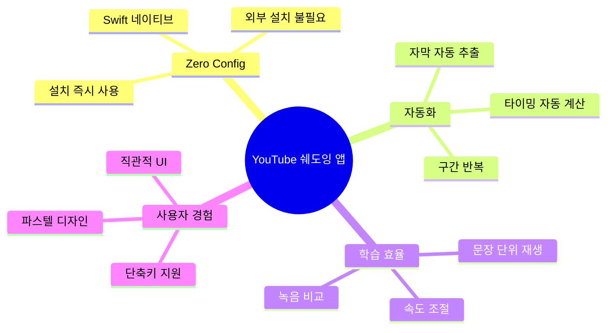

### 0.3 Key Features Summary (핵심 기능 요약)

| 기능 | 설명 | 가치 |
|------|------|------|
| 🎬 **YouTube 스트리밍** | YouTubePlayerKit으로 직접 재생 | 빠른 시작 |
| 🤖 **자막 자동 추출** | swift-youtube-transcript로 자동 가져오기 | 편리함 |
| 📝 **수동 입력 지원** | 자막 없는 영상도 학습 가능 | 유연성 |
| 🔄 **문장 반복** | 각 문장 3회 자동 반복 | 효율적 암기 |
| ⏸️ **자동 일시정지** | 문장 끝에서 자동 멈춤 | 따라 말할 시간 |
| 🎤 **녹음 비교** | 원본 vs 녹음본 재생 | 발음 개선 |
| 🎚️ **속도 조절** | 0.5x ~ 2.0x 재생 속도 | 단계별 학습 |
| ✅ **App Store 안전** | 외부 바이너리 불필요 | 정책 준수 |

---

## 1. Project Overview (프로젝트 개요)

### 1.1 Concept
**YouTube English Shadowing**은 macOS에서 YouTube 영상을 보며 효과적인 **영어 쉐도잉(Shadowing)** 훈련을 할 수 있도록 돕는 학습 도구입니다. **YouTubePlayerKit**을 사용하여 YouTube 영상을 직접 스트리밍하고, **swift-youtube-transcript**로 자막을 자동 추출하여 **문장 단위 반복 재생**과 **사용자 발음 녹음/비교** 기능을 통해 실질적인 스피킹 실력 향상을 목표로 합니다.

### 1.2 Target Audience (타겟 유저)
-   **영어 학습자**: 리스닝과 스피킹 실력을 동시에 키우고 싶은 중급 이상의 학습자
-   **YouTube 시청자**: 좋아하는 YouTube 콘텐츠로 영어 공부까지 하고 싶은 macOS 사용자
-   **쉐도잉 입문자**: 혼자서 쉐도잉 연습을 할 때 구간 반복이나 발음 확인에 어려움을 겪는 사람

### 1.3 Key Technology (핵심 기술)
-   **YouTubePlayerKit**: YouTube 영상 직접 스트리밍 및 재생 제어
-   **swift-youtube-transcript**: YouTube 자막 자동 추출 (MIT License)
-   **Speech Framework**: 사용자 발음 인식 및 텍스트 변환 (STT)
-   **AVFoundation**: 사용자 음성 녹음 및 재생
-   **SwiftUI (macOS 15+)**: 네이티브 macOS 앱 UI with 파스텔 디자인
-   **Combine**: 반응형 데이터 바인딩 및 상태 관리

### 1.4 Technical Constraints (기술 제약사항)
-   **App Store 출시 가능**: 외부 바이너리 미사용으로 정책 준수
-   **macOS 전용**: iOS/iPadOS는 제외 (향후 확장 가능)
-   **개발 환경**: Xcode 16+, macOS 15.0 (Sequoia) 이상
-   **온라인 필수**: YouTube 스트리밍 방식으로 인터넷 연결 필수
-   **앱 크기**: ~5MB (경량 앱)
-   **자막 추출**: swift-youtube-transcript 사용 (자막 없는 영상은 수동 입력)

### 1.5 YouTubePlayerKit Architecture

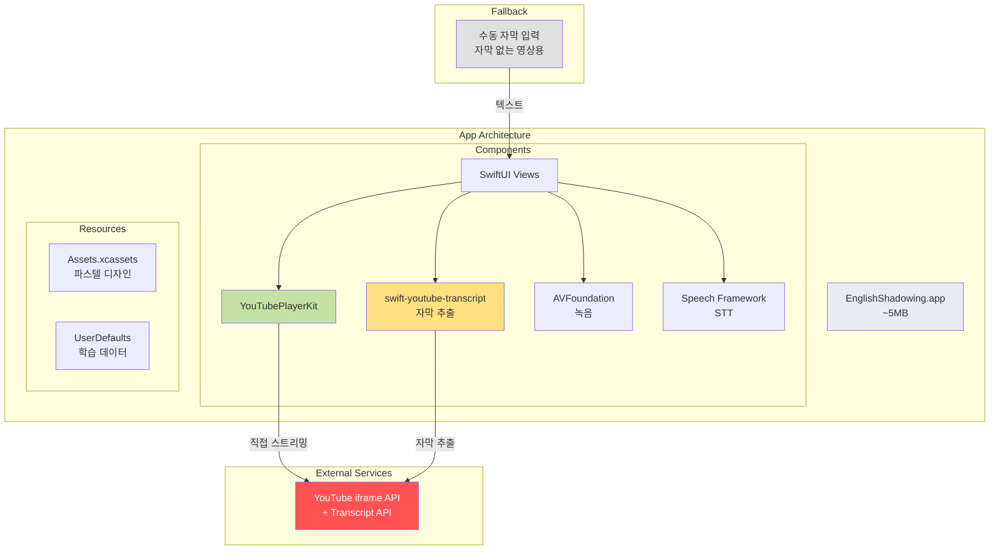

**YouTubePlayerKit + swift-youtube-transcript 장점**:
1. ✅ App Store 정책 완벽 준수 (외부 바이너리 없음)
2. ✅ 경량 앱 (~5MB)
3. ✅ YouTube API 공식 지원
4. ✅ 정밀한 재생 제어 (seek, playbackRate)
5. ✅ 자막 자동 추출 (swift-youtube-transcript)
6. ✅ 간단한 구현

**Trade-offs**:
- ⚠️ 자막 없는 영상 → 사용자 수동 입력 (Fallback)
- ⚠️ 오프라인 불가 → 항상 온라인 필요
- ✅ 법적 안전성 및 유지보수성 우선

### 1.6 Architecture Decision: Swift Native 방식 선택

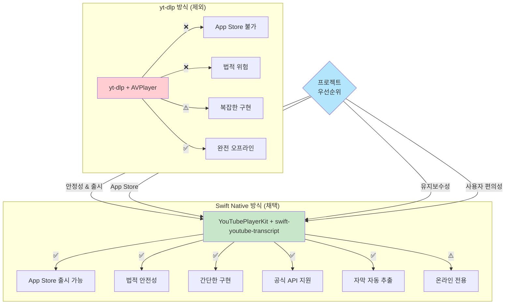

**결론**: YouTubePlayerKit + swift-youtube-transcript로 안정적이고 출시 가능한 앱을 만듭니다.

### 1.7 Design System: 파스텔 톤 가이드

```mermaid
graph LR
    subgraph "Color Palette"
        Primary[Primary<br/>#A8DADC<br/>파스텔 블루]
        Secondary[Secondary<br/>#F1FAEE<br/>아이보리]
        Accent[Accent<br/>#E63946<br/>코랄 레드]
        Success[Success<br/>#C8E6C9<br/>민트 그린]
        Background[Background<br/>#F8F9FA<br/>라이트 그레이]
    end
    
    subgraph "Typography"
        Title[제목<br/>SF Pro Display<br/>Medium]
        Body[본문<br/>SF Pro Text<br/>Regular]
        Caption[캡션<br/>SF Mono<br/>Light]
    end
    
    subgraph "Components"
        Buttons[버튼<br/>라운드 코너<br/>12pt radius]
        Cards[카드<br/>그림자 subtle<br/>8pt padding]
        Lists[리스트<br/>Hover 효과<br/>부드러운 전환]
    end
    
    style Primary fill:#A8DADC
    style Secondary fill:#F1FAEE
    style Accent fill:#E63946,color:#FFF
    style Success fill:#C8E6C9
    style Background fill:#F8F9FA
```

---

## 2. Development Phases (개발 단계)

### Phase 1: Core Architecture Setup
**목표**: macOS 프로젝트 생성 및 Sidebar Navigation 구축

#### 1.1 Xcode Project Setup
- macOS App (SwiftUI, macOS 15.0+)
- Swift Package Dependencies:
  - YouTubePlayerKit
- App Sandbox 설정
- Navigation 기본 구조 (3-column)

#### System Architecture (MVVM + Sidebar Navigation)

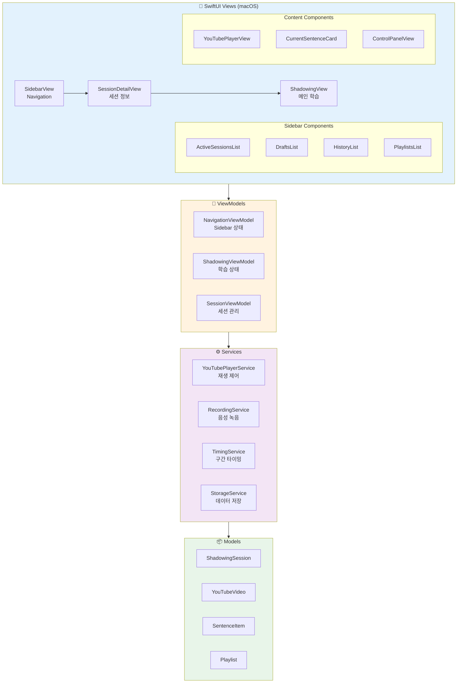

#### Data Flow Diagram

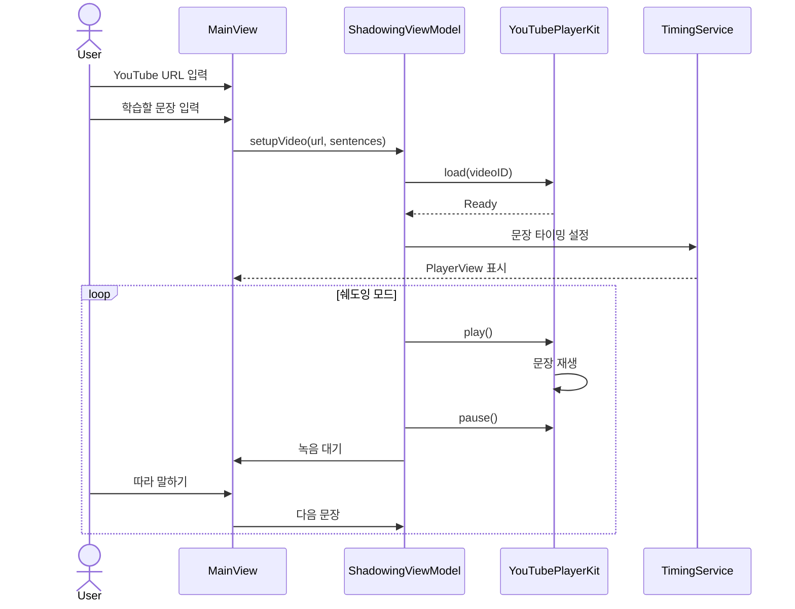

#### Core Models
```swift
struct YouTubeVideo: Identifiable, Codable {
    let id: String  // YouTube Video ID
    var title: String?
    var thumbnailURL: URL?
    var duration: TimeInterval?
}

struct SentenceItem: Identifiable, Codable {
    let id: UUID
    let text: String
    var startTime: TimeInterval  // 사용자가 수동 설정
    var endTime: TimeInterval
    var repeatCount: Int = 3
    var recordings: [URL] = []
    var isCompleted: Bool = false
}

enum SessionStatus: String, Codable {
    case draft      // 작성 중
    case active     // 학습 중
    case completed  // 완료
}

struct ShadowingSession: Identifiable, Codable {
    let id: UUID
    let video: YouTubeVideo
    var sentences: [SentenceItem]
    var status: SessionStatus
    let createdAt: Date
    var updatedAt: Date
    var progress: Double  // 0.0 ~ 1.0
    var completedSentences: Set<UUID>
}

struct Playlist: Identifiable, Codable {
    let id: UUID
    var name: String
    var sessionIDs: [UUID]
    var color: String  // 파스텔 컬러
    let createdAt: Date
}
```

### Phase 2: Sidebar & Session Management
**목표**: Sidebar Navigation 및 세션 관리 구현

#### 2.1 Sidebar Structure
```swift
struct SidebarView: View {
    @StateObject var navigationVM: NavigationViewModel
    @State private var selectedItem: SidebarItem?
    
    enum SidebarItem: Hashable {
        case activeSession(UUID)
        case draft(UUID)
        case history(Date)
        case playlist(UUID)
        case settings
    }
    
    var body: some View {
        List(selection: $selectedItem) {
            Section("📚 Library") {
                DisclosureGroup("✅ Active", isExpanded: .constant(true)) {
                    ForEach(navigationVM.activeSessions) { session in
                        Label(session.video.title ?? "Untitled", 
                              systemImage: "play.circle")
                            .tag(SidebarItem.activeSession(session.id))
                    }
                }
                
                DisclosureGroup("📝 Drafts") {
                    ForEach(navigationVM.drafts) { draft in
                        Label(draft.video.title ?? "New Setup",
                              systemImage: "doc.text")
                            .tag(SidebarItem.draft(draft.id))
                    }
                }
            }
            
            Section("📂 Playlists") {
                ForEach(navigationVM.playlists) { playlist in
                    Label(playlist.name, systemImage: "folder")
                        .tag(SidebarItem.playlist(playlist.id))
                }
            }
        }
        .listStyle(.sidebar)
    }
}
```

#### 2.2 Session Storage (FileManager + Codable)
```swift
class StorageService {
    private let fileManager = FileManager.default
    private var sessionsDirectory: URL {
        fileManager.urls(for: .documentDirectory, in: .userDomainMask)[0]
            .appendingPathComponent("Sessions")
    }
    
    func saveSession(_ session: ShadowingSession) throws {
        let fileURL = sessionsDirectory.appendingPathComponent("\(session.id.uuidString).json")
        let data = try JSONEncoder().encode(session)
        try data.write(to: fileURL)
    }
    
    func loadAllSessions() throws -> [ShadowingSession] {
        let files = try fileManager.contentsOfDirectory(at: sessionsDirectory,
                                                        includingPropertiesForKeys: nil)
        return try files.compactMap { url in
            let data = try Data(contentsOf: url)
            return try JSONDecoder().decode(ShadowingSession.self, from: data)
        }
    }
}
```

### Phase 3: YouTubePlayerKit Integration
**목표**: YouTubePlayerKit을 사용한 영상 재생 구현

#### YouTubePlayerService 구현
```swift
class YouTubePlayerService: ObservableObject {
    @Published var player: YouTubePlayer?
    @Published var currentTime: TimeInterval = 0
    @Published var duration: TimeInterval = 0
    @Published var playbackRate: Double = 1.0
    
    func loadVideo(_ videoID: String)
    func play()
    func pause()
    func seek(to time: TimeInterval)
    func setPlaybackRate(_ rate: Double)
}
```

#### YouTubePlayerKit 기능
1.  **영상 로드**:
    ```swift
    let player = YouTubePlayer(
        source: .video(id: "VIDEO_ID"),
        configuration: .init(
            autoPlay: false,
            loopEnabled: false,
            showControls: false
        )
    )
    ```

2.  **재생 제어**:
    ```swift
    await player.play()
    await player.pause()
    await player.seek(to: startTime, allowSeekAhead: true)
    ```

3.  **상태 모니터링**:
    -   `player.currentTimePublisher` → 현재 재생 시간
    -   `player.playbackStatePublisher` → 재생 상태
    -   Combine으로 실시간 동기화

### Phase 4: Subtitle Extraction & Timing Setup
**목표**: 자막 자동 추출 및 타이밍 설정 구현

#### 핵심 기능
-   **자막 자동 추출**: swift-youtube-transcript로 YouTube 자막 가져오기
-   **문장 병합**: 짧은 자막 조각을 의미 있는 문장 단위로 합치기
-   **수동 입력 지원**: 자막 없는 영상은 사용자가 직접 입력 (Fallback)
-   **타이밍 자동 계산**: 자막 타임스탬프 활용 또는 추정
-   **프리뷰 모드**: 설정한 타이밍대로 재생하여 확인
-   **구간 점프**: 문장 클릭 시 해당 시간으로 이동
-   **재생 속도 조절**: 0.5x ~ 2.0x (학습 속도 조절)

#### App 구조 (Sidebar Navigation)

**macOS 3-Column Layout with Sidebar**

```
┌──────────────────────────────────────────────────────────────────────────┐
│  English Shadowing                                    🎨 ⚙️ 👤          │
├─────────────┬────────────────────────┬───────────────────────────────────┤
│  Sidebar    │  Detail View           │  Content View                     │
│  (200pt)    │  (300pt)               │  (Flexible)                       │
├─────────────┼────────────────────────┼───────────────────────────────────┤
│             │                        │                                   │
│ 📚 Library  │  ┌──────────────────┐ │  ┌─────────────────────────────┐ │
│   ────────  │  │ Session Details  │ │  │  YouTubePlayer              │ │
│ ✅ Active   │  ├──────────────────┤ │  │        800x450              │ │
│   My Video1 │  │ 📹 Video Title   │ │  │  [임베디드 플레이어]         │ │
│   Learning2 │  │ ⏱️  15:30 / 20:00│ │  └─────────────────────────────┘ │
│             │  │ 📊 Progress: 60% │ │                                   │
│ 📝 Drafts   │  │ 🎯 15/25 Done    │ │  ┌─────────────────────────────┐ │
│   New Setup │  └──────────────────┘ │  │ 현재 문장 (#F1FAEE)          │ │
│   Tutorial  │                        │  │ "Hello, welcome to video"   │ │
│             │  ┌──────────────────┐ │  │ 반복: 2/3 ●●○              │ │
│ ✅ History  │  │ Sentence List    │ │  └─────────────────────────────┘ │
│   Dec 27    │  ├──────────────────┤ │                                   │
│   Dec 26    │  │ ✅ #1 Hello...   │ │  ┌─────────────────────────────┐ │
│             │  │ ▶️ #2 This is... │ │  │ Controls (#F1FAEE)          │ │
│ 📂 Playlists│  │ ⏸️ #3 The actual │ │  │ [◀◀] [▶/⏸] [▶▶]           │ │
│   Basics    │  │    Welcome to..  │ │  │                             │ │
│   Advanced  │  │    Another one   │ │  │ 🎤 녹음  ⚙️ 설정          │ │
│             │  └──────────────────┘ │  │ 속도: 0.5x 0.75x [1.0x]     │ │
│ ⚙️ Settings │                        │  │      1.25x 1.5x 2.0x        │ │
│             │  [편집] [삭제] [공유]  │  └─────────────────────────────┘ │
└─────────────┴────────────────────────┴───────────────────────────────────┘
```

**Sidebar 구조** (파스텔 블루 배경 #E3F2FD):
```
📚 Library
├─ ✅ Active Sessions (현재 진행 중)
│  ├─ My First Video
│  ├─ Learning Session 2
│  └─ [+ New Session]
│
├─ 📝 Drafts (임시 저장)
│  ├─ Untitled Setup
│  └─ Tutorial Draft
│
├─ ✅ History (완료된 세션)
│  ├─ 📅 Dec 27, 2024 (3 sessions)
│  ├─ 📅 Dec 26, 2024 (5 sessions)
│  └─ 📅 Dec 25, 2024 (2 sessions)
│
├─ 📂 Playlists (묶음 학습)
│  ├─ English Basics
│  ├─ Advanced Topics
│  └─ [+ Create Playlist]
│
└─ ⚙️ Settings
```

**Detail View** (세션 선택 시):
```
┌────────────────────────┐
│ Session Info           │
├────────────────────────┤
│ 📹 Video Title         │
│ 🆔 VIDEO_ID            │
│ ⏱️  Duration: 15:30    │
│ 📊 Progress: 60%       │
│ 🎯 15/25 완료          │
│ 📅 Created: Dec 27     │
├────────────────────────┤
│ Sentence List          │
│ ┌────────────────────┐ │
│ │ ✅ #1 (00:05-00:10)│ │
│ │ ▶️ #2 (00:10-00:15)│ │
│ │ ⏸️ #3 (00:15-00:20)│ │
│ └────────────────────┘ │
├────────────────────────┤
│ [편집] [삭제] [공유]   │
└────────────────────────┘
```

**Content View** (메인 학습 화면):
- YouTubePlayer (16:9 비율)
- 현재 문장 카드 (파스텔 아이보리)
- 컨트롤 패널 (재생, 녹음, 속도)
- 실시간 진도 표시

**New Session 화면** (Sidebar에서 [+ New Session] 클릭):
```
┌────────────────────────────────────────┐
│  📝 새 쉐도잉 세션 만들기               │
├────────────────────────────────────────┤
│  YouTube URL:                          │
│  ┌──────────────────────────────────┐ │
│  │ https://youtube.com/watch?v=...  │ │
│  └──────────────────────────────────┘ │
│  [🤖 자막 자동 추출] ✅ Video ID 인식  │
│                                        │
│  학습할 문장:                           │
│  ┌──────────────────────────────────┐ │
│  │ Hello, welcome to this video.    │ │  ← 자동 추출됨
│  │ This is a sample sentence.       │ │
│  │ The actual subtitle goes here.   │ │
│  └──────────────────────────────────┘ │
│  📊 10 문장 | 자동 타이밍 적용됨        │
│                                        │
│  💡 자막 없는 영상? 직접 입력하세요     │
│                                        │
│  [임시저장]  [프리뷰]  [시작하기]      │
└────────────────────────────────────────┘
```

**디자인 특징**:
- 모든 카드와 버튼에 12pt 라운드 코너
- Subtle 그림자 (offset: 0,2, blur: 8, opacity: 0.1)
- Hover 시 부드러운 색상 전환 (0.3s ease)
- 파스텔 톤으로 눈의 피로도 감소

### Phase 5: Shadowing Features
**목표**: 쉐도잉 학습에 특화된 기능 구현

#### 쉐도잉 모드
1.  **문장 단위 재생**:
    -   한 문장 재생 후 자동 일시정지
    -   사용자가 따라 말할 시간 제공 (3초)
    -   다음 문장 자동 재생

2.  **반복 학습**:
    -   같은 문장 N회 반복 (기본 3회)
    -   반복 횟수 커스터마이징

3.  **속도 조절**:
    -   느린 속도로 시작 (0.75x)
    -   점진적으로 속도 증가
    -   정상 속도(1.0x) 도달

#### 녹음 및 비교
-   **녹음**: 문장별로 사용자 음성 녹음
-   **재생**: 원본 → 녹음본 순차 재생
-   **저장**: 녹음 파일 로컬 저장 (`~/Documents/Shadowing/`)

### Phase 6: UI/UX Polish & Features
**목표**: macOS 네이티브 경험 제공 및 추가 기능

#### 6.1 Sidebar 추가 기능
-   **드래그 앤 드롭**: 세션을 플레이리스트로 이동
-   **컨텍스트 메뉴**: 우클릭으로 편집/삭제/복제
-   **검색**: Command+F로 세션 검색
-   **정렬**: 이름/날짜/진도 순 정렬
-   **필터**: 완료/진행 중/임시 저장 필터링

#### 6.2 macOS 최적화
-   **메뉴바 지원**: 파일 열기, 설정, 도움말
-   **단축키**: 
    - `Cmd+N`: 새 세션
    - `Space`: 재생/일시정지
    - `←/→`: 이전/다음 문장
    - `Cmd+F`: 검색
    - `Cmd+1/2/3`: Sidebar 섹션 이동
-   **Touch Bar 지원**: MacBook Pro의 Touch Bar 활용
-   **다크 모드**: 시스템 설정 자동 반영
-   **윈도우 크기 조절**: 플레이어 비율 유지
-   **Toolbar**: 빠른 액션 버튼 (새 세션, 검색 등)

---

## 3. Core Features (핵심 기능 상세)

### 3.1 Session Setup Flow

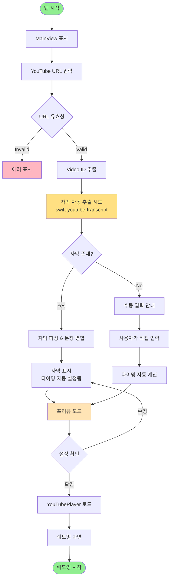

### 3.2 Shadowing Workflow

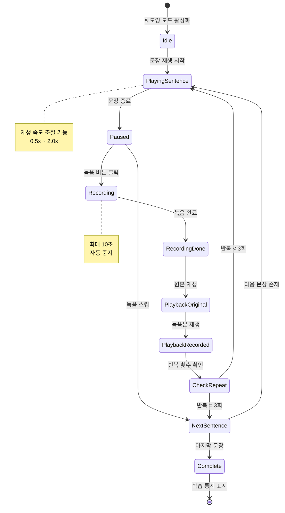

### 3.3 Keyboard Shortcuts (macOS Standard)
| 단축키 | 기능 | 카테고리 |
|--------|------|----------|
| `Cmd+N` | 새 세션 만들기 | Navigation |
| `Cmd+F` | 검색 | Navigation |
| `Cmd+1/2/3` | Sidebar 섹션 이동 | Navigation |
| `Cmd+[` | 뒤로 가기 | Navigation |
| `Cmd+]` | 앞으로 가기 | Navigation |
| `Space` | 재생/일시정지 | Player |
| `←` | 이전 문장 | Player |
| `→` | 다음 문장 | Player |
| `R` | 현재 문장 반복 | Player |
| `Cmd+R` | 녹음 시작/중지 | Recording |
| `[` | 재생 속도 감소 | Player |
| `]` | 재생 속도 증가 | Player |
| `Cmd+,` | 설정 열기 | App |
| `Cmd+W` | 윈도우 닫기 | App |
| `Cmd+Q` | 앱 종료 | App |

---

## 4. Technical Implementation (기술 구현)

### 4.1 Video ID 추출
```swift
func extractVideoID(from url: String) -> String? {
    // YouTube URL 파싱
    // https://www.youtube.com/watch?v=VIDEO_ID
    // https://youtu.be/VIDEO_ID
    
    let patterns = [
        "(?:youtube\\.com\\/watch\\?v=|youtu\\.be\\/)([\\w-]+)"
    ]
    
    for pattern in patterns {
        if let regex = try? NSRegularExpression(pattern: pattern),
           let match = regex.firstMatch(in: url, range: NSRange(url.startIndex..., in: url)) {
            if let range = Range(match.range(at: 1), in: url) {
                return String(url[range])
            }
        }
    }
    
    return nil
}
```

### 4.2 YouTubePlayer 설정
```swift
@MainActor
class ShadowingViewModel: ObservableObject {
    @Published var player: YouTubePlayer?
    @Published var currentSentence: SentenceItem?
    @Published var repeatCount: Int = 0
    
    func setupVideo(videoID: String, sentences: [SentenceItem]) {
        self.player = YouTubePlayer(
            source: .video(id: videoID),
            configuration: .init(
                autoPlay: false,
                loopEnabled: false,
                showControls: false,
                showFullscreenButton: false
            )
        )
        
        self.sentences = sentences
        startShadowing()
    }
    
    func startShadowing() async {
        for sentence in sentences {
            currentSentence = sentence
            
            for _ in 0..<sentence.repeatCount {
                await player?.seek(to: sentence.startTime, allowSeekAhead: true)
                await player?.play()
                
                // 문장 끝까지 재생 대기
                try? await Task.sleep(for: .seconds(sentence.duration))
                
                await player?.pause()
                
                // 사용자 따라 말하기 대기
                try? await Task.sleep(for: .seconds(3))
                
                repeatCount += 1
            }
        }
    }
}
```

### 4.3 문장 타이밍 자동 계산
```swift
func calculateAutoTiming(sentences: [String], interval: TimeInterval = 5.0) -> [SentenceItem] {
    var items: [SentenceItem] = []
    var currentTime: TimeInterval = 0
    
    for text in sentences {
        let estimatedDuration = max(Double(text.count) / 10.0, 3.0)  // 최소 3초
        
        items.append(SentenceItem(
            id: UUID(),
            text: text,
            startTime: currentTime,
            endTime: currentTime + estimatedDuration
        ))
        
        currentTime += estimatedDuration + interval
    }
    
    return items
}
```

---

## 5. Development Roadmap (개발 로드맵)

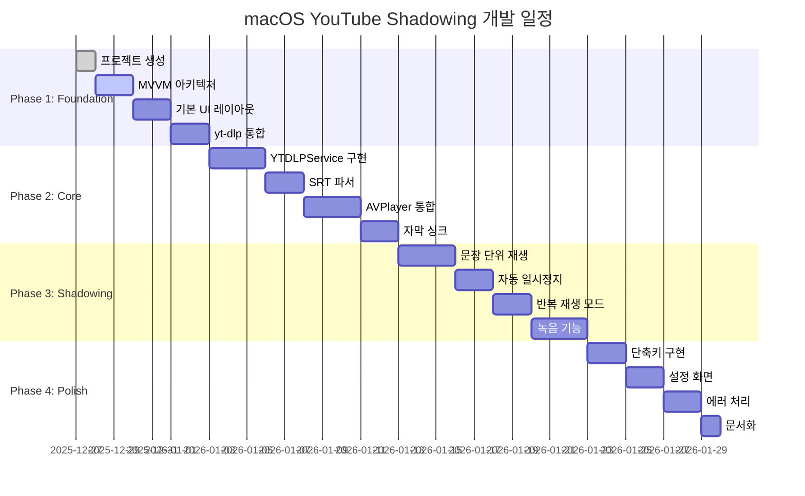

### Milestone Timeline

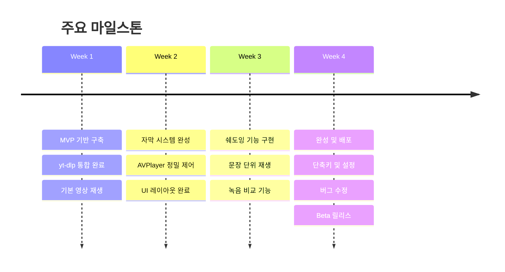

---

## 6. Installation Requirements (설치 요구사항)

### 6.1 시스템 아키텍처 (YouTubePlayerKit)

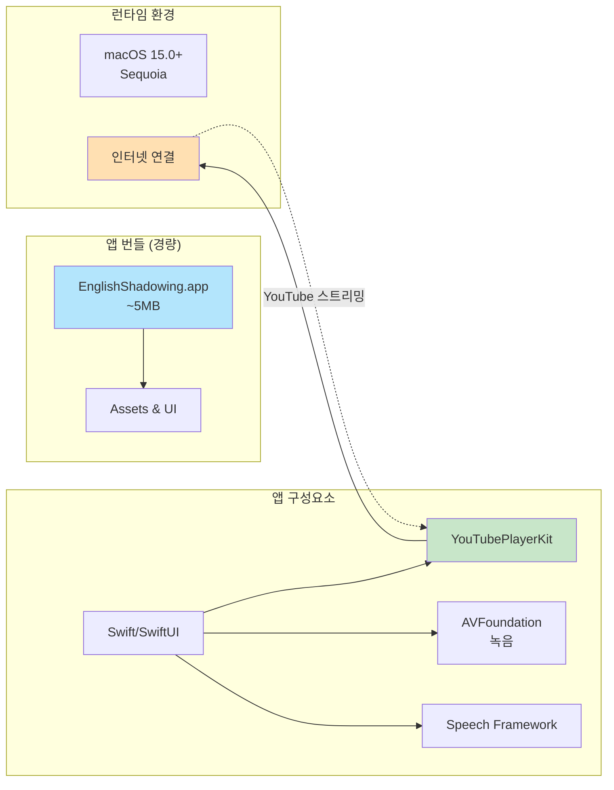

### 6.2 사용자 시스템 요구사항
```
✅ 필수:
- macOS 15.0 (Sequoia) 이상
- 4GB RAM 이상
- 인터넷 연결 (필수)
- 100MB 여유 공간

⚠️ 권장:
- macOS 15.0+ (최신 버전)
- 8GB RAM 이상
- 안정적인 네트워크 (1Mbps 이상)

🎨 디자인 최적화:
- Retina Display 지원
- 다크 모드 자동 전환
- 파스텔 톤 색약자 고려

📦 의존성:
- YouTubePlayerKit (SPM)
- 외부 설치 불필요!
```

### 6.3 앱 첫 실행 시

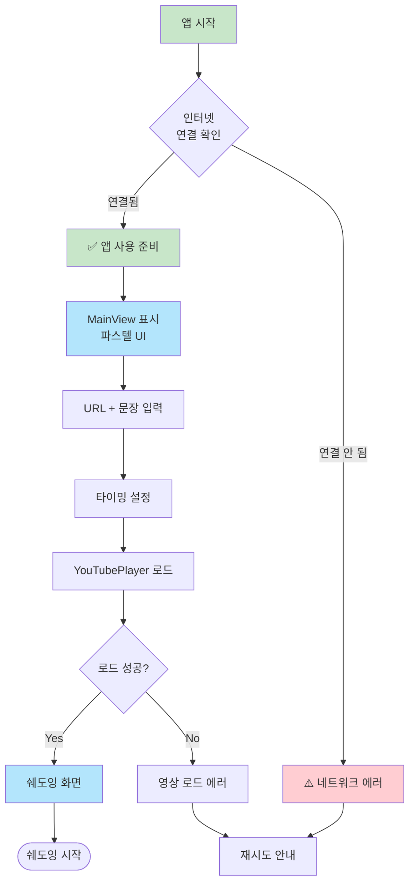

**특징**:
- ✅ 외부 바이너리 없음
- ✅ App Store 정책 준수
- ✅ 경량 앱 (~5MB)
- ⚠️ 온라인 전용

---

## 7. File Structure (파일 구조)

```
EnglishShadowing-macOS/
├── EnglishShadowing/
│   ├── App/
│   │   └── EnglishShadowingApp.swift
│   ├── Views/
│   │   ├── Navigation/
│   │   │   ├── SidebarView.swift            // 3-column Sidebar
│   │   │   ├── SessionListView.swift        // Active/Drafts/History
│   │   │   └── PlaylistListView.swift       // Playlist 관리
│   │   ├── Session/
│   │   │   ├── SessionDetailView.swift      // Detail View (중간)
│   │   │   ├── NewSessionView.swift         // 새 세션 생성
│   │   │   └── SessionEditView.swift        // 세션 편집
│   │   ├── Shadowing/
│   │   │   ├── ShadowingView.swift          // Content View (메인)
│   │   │   ├── YouTubePlayerView.swift      // YouTubePlayer 래퍼
│   │   │   ├── CurrentSentenceCard.swift    // 현재 문장 표시
│   │   │   └── ControlPanelView.swift       // 재생 컨트롤
│   │   └── Components/
│   │       ├── SentenceListView.swift       // 문장 리스트
│   │       ├── TimingEditorView.swift       // 타이밍 수동 설정
│   │       └── ProgressIndicator.swift      // 진도 표시
│   ├── ViewModels/
│   │   └── ShadowingViewModel.swift     // 통합 ViewModel
│   ├── Services/
│   │   ├── YouTubePlayerService.swift   // YouTubePlayerKit 관리
│   │   ├── TranscriptService.swift      // 자막 추출 (swift-youtube-transcript)
│   │   ├── RecordingService.swift       // 음성 녹음
│   │   ├── TimingService.swift          // 타이밍 계산
│   │   └── PersistenceService.swift     // 데이터 저장
│   ├── Models/
│   │   ├── YouTubeVideo.swift
│   │   ├── SentenceItem.swift
│   │   └── ShadowingSession.swift
│   ├── Utilities/
│   │   ├── VideoIDExtractor.swift       // URL 파싱
│   │   └── TimeFormatter.swift          // 시간 포맷팅
│   └── Resources/
│       └── Assets.xcassets
└── README.md
```

---

## 8. Reference (참고 자료)

### Essential
-   [YouTubePlayerKit](https://github.com/SvenTiigi/YouTubePlayerKit) - YouTube 영상 재생
-   [swift-youtube-transcript](https://github.com/spaceman1412/swift-youtube-transcript) - 자막 자동 추출 (MIT License)
-   [YouTube iframe Player API](https://developers.google.com/youtube/iframe_api_reference)
-   [AVFoundation](https://developer.apple.com/documentation/avfoundation) - 음성 녹음
-   [Speech Framework](https://developer.apple.com/documentation/speech) - 음성 인식

### Additional
-   [SwiftUI for macOS](https://developer.apple.com/documentation/swiftui)
-   [Combine Framework](https://developer.apple.com/documentation/combine)

---

## 9. Known Limitations (알려진 제한사항)

1.  **온라인 전용**: 인터넷 연결 필수 (오프라인 불가)
2.  **자막 의존성**: 자막 없는 영상은 수동 입력 필요 (swift-youtube-transcript 제약)
3.  **YouTube 정책**: iframe API 정책 변경 시 영향 가능
4.  **타이밍 정확도**: 자동 추출된 타이밍이 부정확할 수 있음 (수동 조정 권장)
5.  **Age-restricted**: 연령 제한 영상은 재생 불가
6.  **Rate Limiting**: 자막 추출 API 과도한 호출 시 제한 가능

---

## 10. Legal & Licensing (법적 사항 및 라이센스)

### 10.1 Third-Party Software

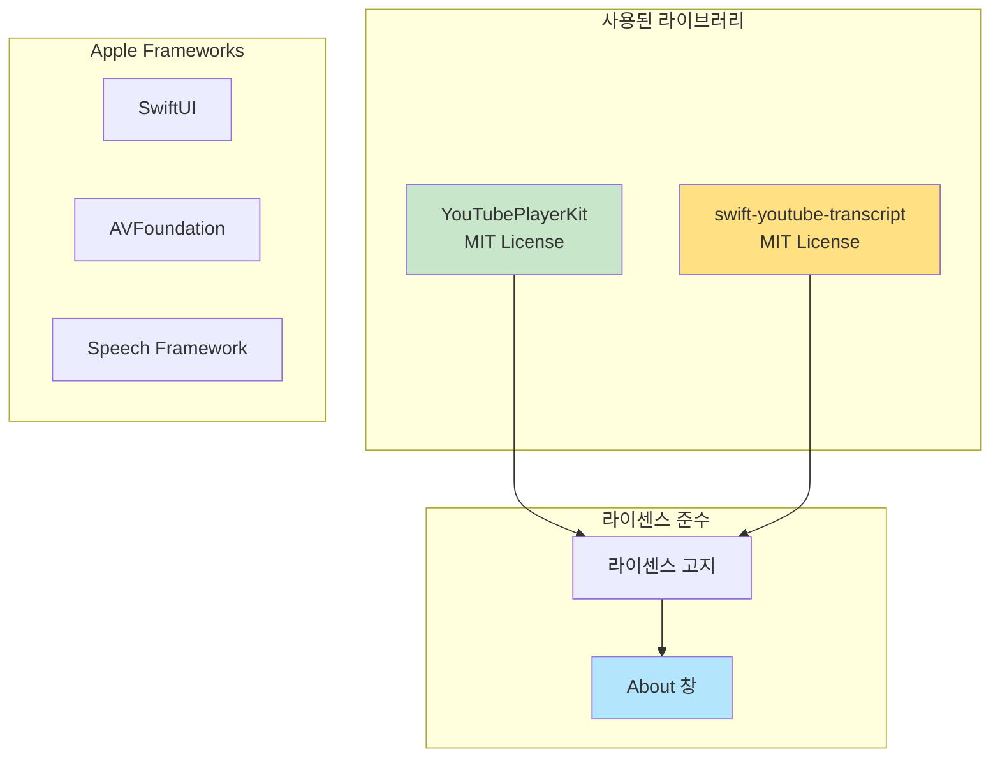

#### YouTubePlayerKit
- **라이센스**: MIT License
- **권리**: 자유롭게 사용, 수정, 배포 가능
- **의무**: 라이센스 고지 포함
- **링크**: [GitHub Repository](https://github.com/SvenTiigi/YouTubePlayerKit)

#### swift-youtube-transcript
- **라이센스**: MIT License
- **권리**: 자유롭게 사용, 수정, 배포 가능
- **의무**: 라이센스 고지 포함
- **링크**: [GitHub Repository](https://github.com/spaceman1412/swift-youtube-transcript)
- **권리**: 자유롭게 사용, 수정, 배포 가능
- **의무**: 라이센스 고지 포함
- **링크**: [GitHub Repository](https://github.com/SvenTiigi/YouTubePlayerKit)

### 10.2 License Compliance UI

```
앱 메뉴 → About English Shadowing

┌─────────────────────────────────────────────┐
│  English Shadowing v1.0.0                   │
│  YouTube 영어 쉐도잉 학습 도구               │
├─────────────────────────────────────────────┤
│  이 앱은 다음 오픈소스 라이브러리를 사용합니다: │
│                                              │
│  • YouTubePlayerKit (MIT License)           │
│    by Sven Tiigi                            │
│    https://github.com/SvenTiigi/            │
│      YouTubePlayerKit                       │
│                                              │
│  • swift-youtube-transcript (MIT License)   │
│    by spaceman1412                          │
│    https://github.com/spaceman1412/         │
│      swift-youtube-transcript               │
│                                              │
│    [View Licenses] 버튼                     │
│                                              │
│  소스 코드:                                  │
│  [GitHub Repository] 버튼                   │
└─────────────────────────────────────────────┘
```

### 10.3 YouTube iframe API Terms

✅ **정책 준수**:
- YouTube iframe API 사용 (공식 지원)
- 영상 다운로드 없음 (스트리밍만)
- YouTube 서비스 약관 완전 준수
- App Store 출시 가능

**사용자 안내**:
```
이 앱은 YouTube의 공식 iframe Player API를 
사용하여 영상을 재생합니다.

- 영상은 다운로드되지 않습니다
- YouTube 서버에서 직접 스트리밍됩니다
- YouTube 정책을 완전히 준수합니다
- 개인 학습 목적으로 사용하세요
```

### 10.4 App Store 출시 준비

✅ **정책 준수 사항**:
1. 외부 바이너리 미사용
2. YouTube 공식 API 사용 (영상 재생)
3. 자막 자동 추출 (공개 데이터 활용)
4. 영상 다운로드 기능 없음
5. 오픈소스 라이센스 고지
6. 개인정보 수집 없음

⚠️ **검토 시 주의사항**:
- YouTube API 사용 목적 명시
- 교육 목적 앱임을 강조
- 자막 추출은 공개 자막 활용 (개인 학습 목적)
- 스크린샷에 저작권 없는 영상 사용

---

## 11. Future Enhancements (향후 개선사항)

### Phase 2 Features
-   **학습 기록 및 통계**: 일일 학습 시간, 완료한 문장 수
-   **단어장 기능**: 어려운 단어 저장 및 복습
-   **AI 발음 분석**: Speech Recognition으로 정확도 측정
-   **iCloud 동기화**: 여러 Mac에서 학습 진도 공유
-   **다국어 자막 지원**: 영어 외 다른 언어 자막 추출

### Advanced Features
-   **자막 품질 개선**: 문장 병합 알고리즘 고도화
-   **Playlist 지원**: 여러 영상을 순차적으로 학습
-   **학습 목표 설정**: 일일/주간 목표 설정 및 알림
-   **iOS/iPadOS 확장**: iPhone, iPad 버전 개발
-   **커스텀 자막 편집**: 타이밍 및 텍스트 수정 기능

---

**문서 버전**: 3.0.0  
**작성일**: 2025-12-28  
**최종 수정**: 2025-12-28 (swift-youtube-transcript 추가)  
**목적**: macOS 전용 YouTube 쉐도잉 학습 도구 개발
